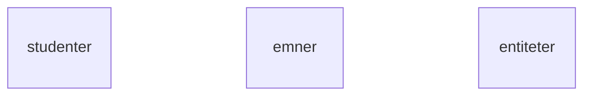

# Forelesningsmanus 2026-02-24: Fra modell til database
- Vi har sett hvordan vi kan bruke filer på en datamaskin og ved hjelp av et programmeringsmiljø, som består av et programmeringsspråk og en kompilator, lagre data i filer og hente data fra filer.
- Vi har også sett at vi kan bruke flere programmeringsmiljøer for å lage visninger (i nettleser, for eksempel) av data fra filene og skjemaer for å legge inn data i filene.
- Dette kalte vi for et tre-lags arkitektur, med visning på "toppen", mellomlaget med funksjoner fra programmeringsmiljøet og filer som den fysiske måten å lagre data på disk over lengre tid, dvs. permanent.
- Vi har sett på utfordringene med å overføre data fra et mer permanent minne (HDD, SSD) til et flyktig minne (RAM) og eventuelle kostnader knyttet til maskinvaren
- Vi har sett også på at data kan overføres mellom datamaskiner ved hjelp av et nettverks infrastruktur, som vi kaller for Internett, og et rammeverk WorldWideWeb (HTML og HTTP).
- Vi har sett på flere sikkerhetsutfordringer når data "transporteres" mellom mange funksjoner fra et lagringssted til en visning (hvor et menneske kan bruke dem) og fra visning gjennom en (web) form/skjema til et lagringssted (server). 
- I den reelle verden har vi ofte behov for å samle data om forskjellige ting. For eksempel, hvor mye penger har vi brukt på mat i en måned, hva er hjerterytme til en toppidrettsutøver under konkurranser, hva er stillingen i diverse idrettskonkurranser som vi følger med på, hvilke serier (en liste) har jeg sett på de forskjellige streamingstjenester og hvor mye har jeg betalt for disse osv. Vanligvis har også foretak og institusjoner spesielle lagringsbehov, hvor data om diverse entiteter blir samlet inn og spesifikke hendelser registrert på disse entitetene i løpet av en tidsperiode. 
- Hovedspørsmålet for DATA1500 er hvordan kan vi designe en database for diverse behov og implementere den på en datamaskin eller flere datamaskiner? 
- Det finnes mange måter å strukturere hvilken som helst datamengde og måten man gjør det på er ofte avhengig av konteksten (sluttbrukerbehov, behov for maskinvare, krav til ytelse, krav til sikkerhet, tiden man har til rådighet for implementasjon og testing osv.). En slik kontekst ofte beskrives med en systemutviklingsprosess (fra kravinnsamling til deployering av en operativ applikasjon, som så godt som mulig tilfredsstiller brukerens og kundens krav).
- La oss se på det samme eksemplet som vi har brukt så langt, dvs. en datamodell for lagring av informasjon om studenter, emner, programmer og emneregistreringer.
- Når vi har valgt entiteter, så er vi allerede forbi dem første fasen av kravanalyse. Hvis vi antar at vår kunde er et utdanningsinstitusjon som har dokumentert sine behov (våre krav) på følgende måte:
    - Vi tar opp studenter fortløpende på våre programmer. En student kan bli tatt opp på ett program. Vi trenger å registrere nye studenter og få oversikt over studenter som allerede er registrert hos oss. Vi trenger ofte å søke etter studentnavn (fornavn og etternavn) når vi har studentens e-postadresse.
    - Studentene må følge ett program, og de kan melde seg på et eller flere emner. Vi må kunne registrere både nye studenter og nye emner uten av studenten må nødvendigvis blir meldt på et emne. 
- Hvordan skal vi "komme i gang" med datamodellering? La oss si vi ønsker å finne eniteter for en datamodell, som kan tilfredstille kravene fra utdanningsinstitusjonen. 
- Ofte er krav presentert som en kravliste eller som en mindre strukturert tekst. Kandidater til entiter kan være substantiver i denne teksten. 
- For eksempel, her er substantiver markert i vår krav-tekst:
    - Vi tar opp **studenter** fortløpende på våre **programmer**. En **student** kan bli tatt opp på ett **program**. Vi trenger å registrere nye **studenter** og få **oversikt** over **studenter** som allerede er registrert hos oss. Vi trenger ofte å søke etter **studentnavn** (**fornavn** og **etternavn**) når vi har studentens **e-postadresse**.
    - **Studentene** må følge ett **program**, og de kan melde seg på et eller flere **emner**. Vi må kunne registrere både nye **studenter** og nye **emner** uten at **studenten** må nødvendigvis blir meldt på et **emne**.
- Substantivene som er brukt her er: **studenter**, **programmer**, **emner**, **studentnavn**, **fornavn**, **etternavn**, **oversikt**. Alle disse substantivene er kandidater til enten å være entiteter eller attributter til entiteter. Basert på denne listen kan vi ta mange valg. Ofte må man prøve forskjellige varianter og se hvordan modellene funksjonerer med data. Det er også vanlig at kravspesifikasjon inneholder nøyaktig informasjon om hva som skal lagres og eventuelt over hvor lang tid.
- Vi sitter nå med en type fasit (som på ingen måte er optimal) og la oss prøve med **studenter**, **programmer** og **emner**, som entiteter. 



- En mulig måte å se på det generelt er *3-skjema arkitektur*
	- For å lagre databasebeskrivelse (skjema, *en. schema*) brukes det en `katalog` i DBHS.
	```sql
	SELECT schema_name, schema_owner FROM information_schema.schemata;
	    schema_name     |   schema_owner    
	--------------------+-------------------
	 public             | pg_database_owner
	 information_schema | admin
	 pg_catalog         | admin
	(3 rows)
	```
	- For å vise skjemaene for den gjeldende bruker (`current_user`) kan man også bruke kiosk-kommando `\dn` (d - describe, n - namespace).
	- Data og programmer er isolert.
	- Støtter flere brukervisninger.
- Poenget med *3-skjema arkitektur* er å separare brukerapplikasjoner fra den fysiske databasen (den fysiske lagringen på maskinvare).
- Skjemaer kan defineres på tre nivåer:
    - Det **interne nivået** (eller det interne skjemaet) for å beskrive den fysiske lagringen.
    - Det **konseptuelle nivået** (eller det konseptuelle skjema) for å beskrive strukturen til hele database for en gruppe brukere; dette skjemaet skjuler detaljene av de fysiske datastrukturene og beskriver entiteter, datatyper, forhold, brukeroperasjoner og betingelser/begrensninger. Implementasjonens konseptuelt skjema er basert på et konseptuelt skjemadesign i en høyt-nivå (abstraksjon) data modell.
    - Det **eksterne eller visnings nivå** kan presenteres ved en rekke eksterne skjemaer og brukervisninger. Hvert av de eksterne skjemaene beskriver et utsnitt av data fra databasen, som en brukergruppe er interessert i.
- I de fleste DBHS, som støtter brukervisninger (*en. views*), de eksterne skjemaene blir spesifisert i den samme datamodellen, som inneholder informasjon av det konseptuelle nivået.

