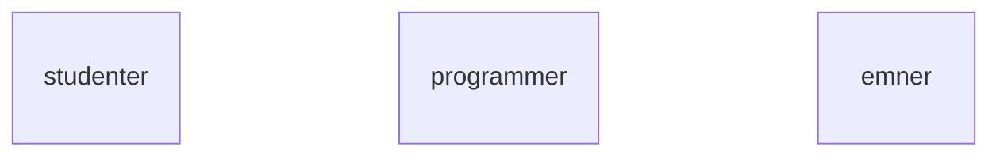
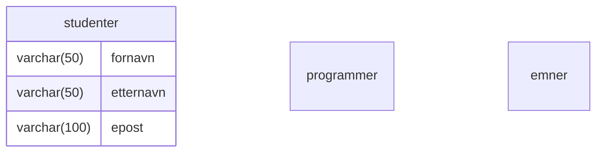
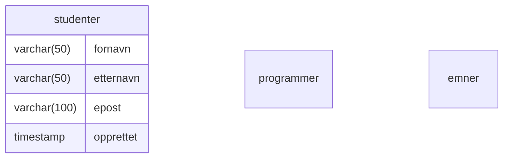
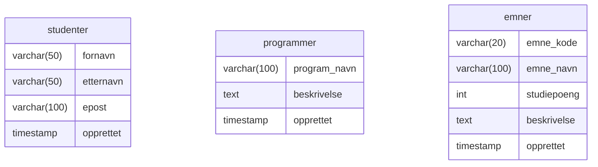
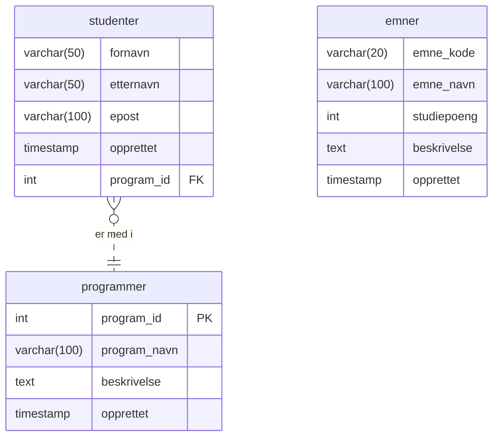
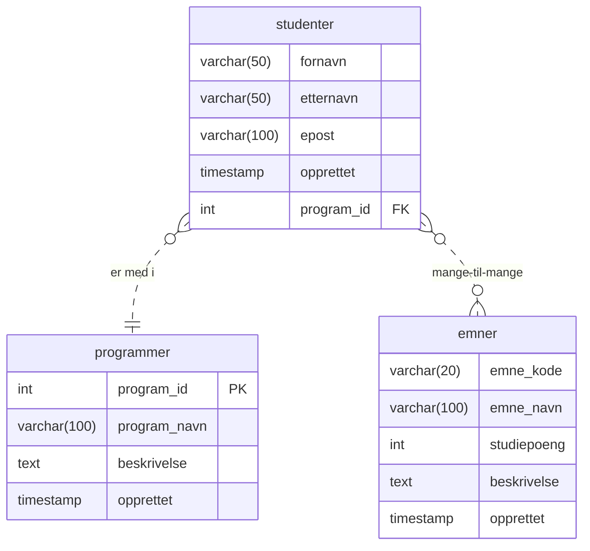
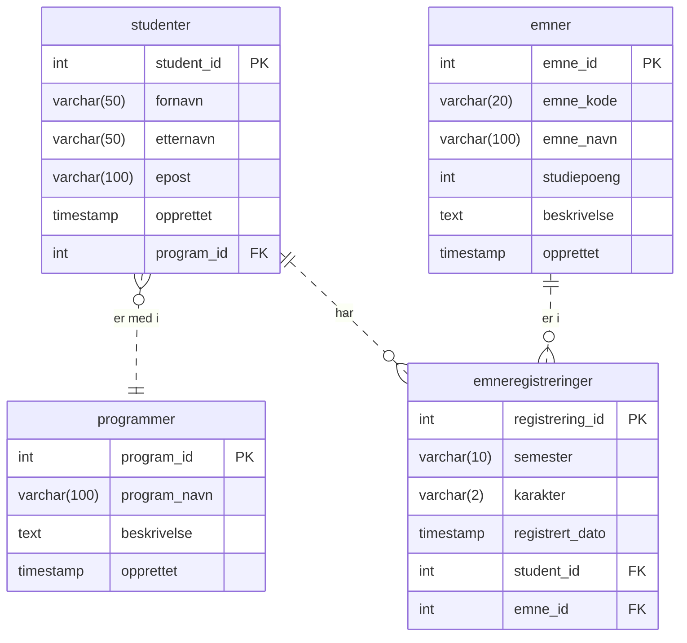
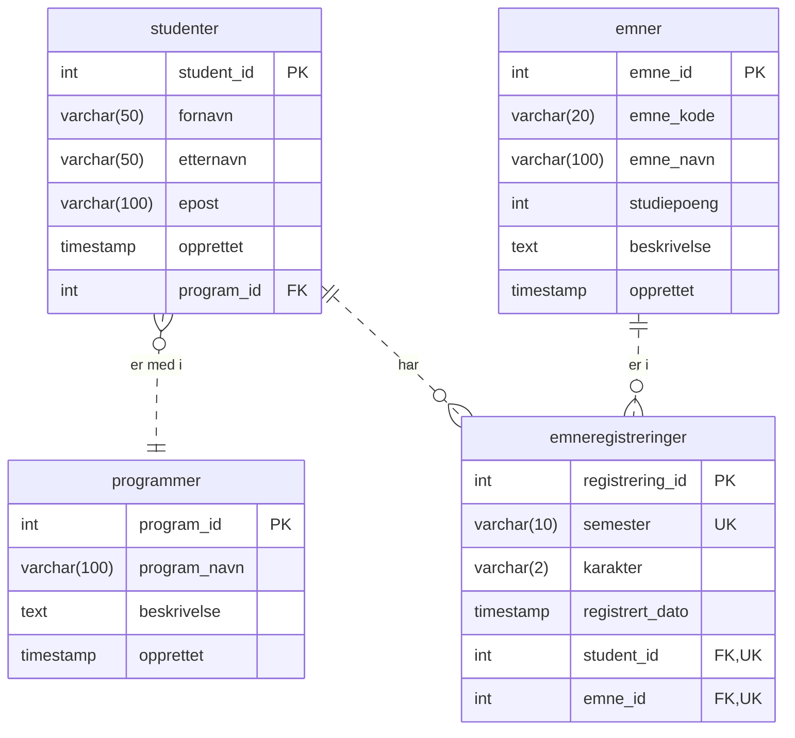

# Forelesningsmanus 2026-02-04: Fra modell til database
- Vi har sett hvordan vi kan bruke filer på en datamaskin og ved hjelp av et programmeringsmiljø, som består av et programmeringsspråk og en kompilator, lagre data i filer og hente data fra filer.
- Vi har også sett at vi kan bruke flere programmeringsmiljøer for å lage visninger (i nettleser, for eksempel) av data fra filene og skjemaer for å legge inn data i filene.
- Dette kalte vi for et tre-lags arkitektur, med visning på "toppen", mellomlaget med funksjoner fra programmeringsmiljøet og filer som den fysiske måten å lagre data på disk over lengre tid, dvs. permanent.
- Vi har sett på utfordringene med å overføre data fra et mer permanent minne (HDD, SSD) til et flyktig minne (RAM) og eventuelle kostnader knyttet til maskinvaren
- Vi har sett også på at data kan overføres mellom datamaskiner ved hjelp av et nettverks infrastruktur, som vi kaller for Internett, og et rammeverk WorldWideWeb (HTML og HTTP).
- Vi har sett på flere sikkerhetsutfordringer når data "transporteres" mellom mange funksjoner fra et lagringssted til en visning (hvor et menneske kan bruke dem) og fra visning gjennom en (web) form/skjema til et lagringssted (server). 
- I den reelle verden har vi ofte behov for å samle data om forskjellige ting. For eksempel, hvor mye penger har vi brukt på mat i en måned, hva er hjerterytme til en toppidrettsutøver under konkurranser, hva er stillingen i diverse idrettskonkurranser som vi følger med på, hvilke serier (en liste) har jeg sett på de forskjellige streamingstjenester og hvor mye har jeg betalt for disse osv. Vanligvis har også foretak og institusjoner spesielle lagringsbehov, hvor data om diverse entiteter blir samlet inn og spesifikke hendelser registrert på disse entitetene i løpet av en tidsperiode. 
- Hovedspørsmålet for DATA1500 er hvordan kan vi designe en database for diverse behov og implementere den på en datamaskin eller flere datamaskiner? 
- Det finnes mange måter å strukturere hvilken som helst datamengde og måten man gjør det på er ofte avhengig av konteksten (sluttbrukerbehov, behov for maskinvare, krav til ytelse, krav til sikkerhet, tiden man har til rådighet for implementasjon og testing osv.). En slik kontekst ofte beskrives med en systemutviklingsprosess (fra kravinnsamling til deployering av en operativ applikasjon, som så godt som mulig tilfredsstiller brukerens og kundens krav).
- La oss se på det samme eksemplet som vi har brukt så langt, dvs. en datamodell for lagring av informasjon om studenter, emner, programmer og emneregistreringer.
- Når vi har valgt entiteter, så er vi allerede forbi dem første fasen av kravanalyse. Hvis vi antar at vår kunde er et utdanningsinstitusjon som har dokumentert sine behov (våre krav) på følgende måte:
    - Vi tar opp studenter fortløpende på våre programmer. En student kan bli tatt opp på ett program. Vi trenger å registrere nye studenter og få oversikt over studenter som allerede er registrert hos oss. Vi trenger ofte å søke etter studentnavn (fornavn og etternavn) når vi har studentens e-postadresse.
    - Studentene må følge ett program, og de kan melde seg på et eller flere emner. Vi må kunne registrere både nye studenter og nye emner uten at studenten må nødvendigvis bli meldt på et emne. 
- Hvordan skal vi "komme i gang" med datamodellering? La oss si vi ønsker å finne eniteter for en datamodell, som kan tilfredstille kravene fra utdanningsinstitusjonen. 
- Ofte er krav presentert som en kravliste eller som en mindre strukturert tekst. Kandidater til entiter kan være substantiver i denne teksten. 
- For eksempel, her er substantiver markert i vår krav-tekst:
    - Vi tar opp **studenter** fortløpende på våre **programmer**. En **student** kan bli tatt opp på ett **program**. Vi trenger å registrere nye **studenter** og få **oversikt** over **studenter** som allerede er registrert hos oss. Vi trenger ofte å søke etter **studentnavn** (**fornavn** og **etternavn**) når vi har studentens **e-postadresse**.
    - **Studentene** må følge ett **program**, og de kan melde seg på et eller flere **emner**. Vi må kunne registrere både nye **studenter** og nye **emner** uten at **studenten** må nødvendigvis blir meldt på et **emne**.
- Substantivene som er brukt her er: **studenter**, **programmer**, **emner**, **studentnavn**, **fornavn**, **etternavn**, **oversikt** og **e-postadresse**. Alle disse substantivene er kandidater til enten å være entiteter eller attributter til entiteter. Basert på denne listen kan vi ta mange valg. Ofte må man prøve forskjellige varianter og se hvordan modellene funksjonerer med data. Det er også vanlig at kravspesifikasjon inneholder nøyaktig informasjon om hva som skal lagres og eventuelt over hvor lang tid.
- Det er vanlig å presentere databasemodeller med diagrammer.
- Diagrammene som illustrerer/beskriver en relasjonsmodell blir kalt for *Entity Relationship diagrammer*.
- Det er flere notasjoner for ER-diagrammer, som er i bruk i praksis (i reelle prosjekter) og i litteraturen. 
- I pensumboken for DATA1500 våren 2026, blir en såkalt kråkefot-notasjon brukt. En annen type diagram bruker Chen-notasjon (ble introdusert av Peter Chan i 1976).
- Før vi går videre, la oss bestemme oss for notasjon i ER-diagrammer og hvordan vi skriver navn på entiteter og attributter. 
- Vi velger 
    - å bruke kråkefot-notasjon (som i pensumboken)
    - å navngi entitetene med flertalls-former (dvs. `studenter` og ikke `student`)
    - å bruke såkalt `snake-case` for å navngi, dvs. hvis et navn for en entitet eller et attributt er satt sammen av flere ord, så brukes det `_` (i Unicode U+005F LOW LINE) mellom disse ordene, for eksempel `emne_navn`, `emne_kode`, `program_navn` osv. OBS! Vi skal ikke bruke `snake-case` på tabellnavn (vær kreativ).
    - å bruke spesifikk notasjon for såkalte *constraints*, nøkler og indekser når den tid kommer (spesifiserer mer detaljert senere)
    - vi bruker applikasjon `mermaid` for å skrive kode til diagrammene i Markup og vise dem i Github eller eventuelt å ta en skjermbilde av diagrammet i [mermaid.live](https://mermaid.live/) applikasjonen (det finnes også skriverbordsapplikasjoner som kan vise Markdown i form av WYSIWYG).
    - I entitetsboksene til `mermaid` noterer vi først datatypen til attributten, så navnet til attributten og så informasjon om nøkler og eventuelt noen kommentarer eller `constraints` til slutt.
- Vi fortsetter med oppgaven og velger kandidat-substantiver for entiteter i datamodellen for emneregistrering.
- Vi har nå en type fasit tilgjengelig (i Oppgavesett 1.3), som på ingen måte er optimal, så la oss prøve med **studenter**, **programmer** og **emner**, som entiteter. 
- Her er et eksempel på hvordan man kan "lage" entiteter i `mermaid` og hvordan det blir tolket av Github. Entitetene i ER-diagrammet vises som firkantede bokser.
``` 
erDiagram
    studenter
    programmer
    emner
```

- Hva med de andre substantivene? **studentnavn** er en god kandidat til å være en attributt for entiteten **studenter** (hva hvis den blir valgt som entitet?); vi kan velge den, hvis vi ikke ønsker å dele opp i fornavn og etternavn, for eksempel.
- Siden vi har både **fornavn** og **etternavn** nevnt i spesifikasjonen, så er det naturlig å tenke at disse kan være attributter for **studenter**.
- **oversikt** kan være en visning for sluttbruker, så den er kanskje ikke den beste kandidaten for hoved-entitetene i modellen. 
- **e-postadresse** er definitivt en god attributt for en student, spesielt når det er nevnt i kravspesifikasjonen at brukere/kunder ønsker å gjøre søk basert på den.
- Dere merker sikkert at formuleringene for valg vi gjør er vage. I praksis vil du ofte se på eksisterende datamodeller og gjenbruke kunnskapen fra disse, men du må utvikle en fleksibel tankegang, da det ikke er uvanlig å komme opp i situasjoner hvor brukerkrav kan kreve en spesiell datamodell. Husk også at en (konseptuell) datamodell er begrenset av de mulighetene som du har i forhold til DBHS og maskinvaren, som vi har tatt opp tidligere i dette emne.
- La oss velge **fornavn**, **etternavn** og **e-postadresse** som attributter for en instans fra `studenter`, som da er en spesifikk `student`.
- I `mermaid` kan du enkelt legge til attributter med den datatypen (i literaturen kalt `domen`) som du mener er hensiktsmessig i forhold til kravspesifikasjonen, men også til operasjoner, som du eventuelt ser, den kan bli brukt med. Det finnes også datatyper i DBHS, som dekker meget vanlige behov for databasedesignere og databasebrukere, som flere typer for datoer (timestamp, date) og typer for forskjellige talltyper (heltall, flytetall) osv.
- Her tenker vi at det finnes ikke (eller meget sjeldent) lengre fornavn eller etternavn enn 50 tegn. Vi tenker også at en e-postadresse kan bli lenger enn 50 tegn. Internet Engineering Task Force (IETF) definerer 254 som en maksimal lengde for en gyldig e-postadresse, og som de fleste e-post applikasjoner skal respektere). Så vårt valg at 100 tegn kan være for lite, men hvis vi øker den til 254, bruker vi veldig mye ekstraplass, siden sannsynlighet at vi får en e-postadresse over 100 tegn er meget liten.
```
erDiagram
    studenter {
    	varchar(50) fornavn
        varchar(50) etternavn
    	varchar(100) epost
    }
    programmer {}
    emner {}
```

- Det er vanlig å legge til en del ekstra-attributter (felt), som ikke er spesifisert i kravspesifikasjonene. Det kan være attributter for tidspunkt når den konkrete raden ble endret og også av hvem. Ofte brukes slike ekstra-attributter for å monitorere bruken av databasen. Som et eksempel, foreslår vi å legge til et attributt for når raden ble **opprettet** med datatypen `timestamp`. Hvis vi skulle endre raden, for eksempel, hvis en student har fått en ny e-postadresse, så kan vi endre kun e-post attributten og ikke endre **opprettet** tidspunktet.
```
erDiagram
    studenter {
   		varchar(50) fornavn
        varchar(50) etternavn
    	varchar(100) epost
    	timestamp opprettet
    }
    programmer {}
    emner {}
```

- Oppgaven nå er å ressonere seg frem til hvorfor `emner` og `programmer` skal være entiteter, hvilke attributter de skal ha og hvilken datatype disse attributten bør ha i databasen (merk at datatype har direkte innvirkning på hvor stor plass verdien for attributten skal oppta i et lagringsmedium).
- Vi gjør en quiz nå om valg av entiteter, attributter og datatyper
- I kravspesifikasjonen er det lite informasjon om hva ønsker man å lagre om emner og programmer. I en reell situasjon hadde vi gått tilbake til kunden og spurt om flere detaljer. 
- Anta at vi har spurt kunden og den har sagt at den ønsker å lagre `program_navn`, og `beskrivelse` om programmer, og `emne_kode`, `emne_navn`, `studiepoeng`, ``og `beskrivelse` om emner. 
- Da kan vi utvide vårt diagram med følgende (vi legger også på en `opprettet` kolonne med timestamp-type, som blir gjort i reelle applikasjoner for å kunne monitorere innsettinger i databasen):
```
erDiagram
    studenter {
   		varchar(50) fornavn
        varchar(50) etternavn
    	varchar(100) epost
    	timestamp opprettet
    }
    programmer {
    	varchar(100) program_navn
    	text beskrivelse
    	timestamp opprettet
    }
    emner {
    	varchar(20) emne_kode
    	varchar(100) emne_navn
    	int studiepoeng
    	text beskrivelse
    	timestamp opprettet
    }
```

- Nå, som vi har funnet noen entiteter, må vi se på hva står i kravspesifikasjonen / teksten om forhold mellom disse enitetene. For eksempel, står det: "En **student** kan bli tatt opp på ett **program**". Vi kan med sikkerhet anta at det er flere studenter som kan bli tatt opp på ett program. Derfor kan vi modellere denne teksten med en "en-til-mange" relasjon hvor "en student kan delta i ett program og ett program kan ha mange studenter". Vi kan også anta at når vi registrerer en ny student, vet vi allerede hvilket program studenten skal delta i. Derfor kan vi modellere med en fremmenøkkel fra `studenter` til `programmer` og den såkalte kardinaliteten blir at en student må ha nøyaktig ett program, dvs. både minimums- og maksimumskardinalitet er 1. Når det gjelder kardinalitet på `studenter`-siden, så må et program være registrert før man setter inn data om nye studenter, så minimumskardinalitet er 0 og maksimumskardinalitet er *mange*. Kardinalitet 1 betegnes med '|', kardinalitet 0 betegnes med 'o' og kardinalitet *mange* betenges med enten '{' eller '}' avhengig av hvilken retning vi ønsker å spesifisere den. I dette eksemplet skal følgende skrives inn i `mermaid`-koden: `studenter }o..|| programmer: "er med i"`. Vi kan legge alle forhold til på slutten av koden. Vi velger også en egen primærnøkkel (PK) for `programmer` og legger inn en fremmednøkkel (FK) mot entiteten `programmer` i entiteten `studenter`. Hvilke andre valg kunne man gjort for primærnøkkel for entiteten `programmer`?
```
erDiagram
    studenter {
   		varchar(50) fornavn
        varchar(50) etternavn
    	varchar(100) epost
    	timestamp opprettet
    	int program_id FK
    }
    programmer {
    	int program_id PK
    	varchar(100) program_navn
    	text beskrivelse
    	timestamp opprettet
    }
    emner {
    	varchar(20) emne_kode
    	varchar(100) emne_navn
    	int studiepoeng
    	text beskrivelse
    	timestamp opprettet
    }
    studenter }o..|| programmer: er med i
```

- Legg merke til at forholdet er markert med en stiplet linje. Det markere at forholdet er **ikke-identifiserende**. Foreløpig kan vi huske på at det er på grunn av at begge entitetene vil får sin egen identfikator, dvs. den enes identifikator inneholder ikke den andre identfikator. 
- Det er ikke flere eksplisitt spesifiserte forhold i kravspesifikasjonen mellom `studenter`, `emner` og `programmer`.
- Hvilke forhold kunne du tenke deg at kunne vært relevante? 
- Man kunne tenke seg en mulighet hvor studenter kan være med på flere studier og et emner hører til studier (på Oslomet så kan emner inngå i flere studier, så det hadde da vært en mange-til-mange relasjon, dvs. `}..{`, som da krever en koblingsentitet/assosiativ entitet, - om det senere).
- Vi ser at studenter skal kunne melde seg på emner, og vi kan ressonere oss frem til at en student bør ha mulighet til å melde seg på flere emner og et emne kan ha flere studenter påmeldt. Så da har vi en mange-til-mange relasjon. 
```
erDiagram
    studenter {
   		varchar(50) fornavn
        varchar(50) etternavn
    	varchar(100) epost
    	timestamp opprettet
    	int program_id FK
    }
    programmer {
    	int program_id PK
    	varchar(100) program_navn
    	text beskrivelse
    	timestamp opprettet
    }
    emner {
    	varchar(20) emne_kode
    	varchar(100) emne_navn
    	int studiepoeng
    	text beskrivelse
    	timestamp opprettet
    }
    studenter }o..|| programmer: "er med i"
    studenter }o..o{ emner: "mange-til-mange"
```

- Slik som modellert nå, så kan både `emner` og `studenter` eksistere for seg selv, men vi har sett fra kravspesifikasjonen at vi må introdusere et sterkere forhold mellom disse to entitetene. Vi må se på funksjonelle avhengigheter i de to tabellene (husk fra forrige gang) og bestemme for hvilke unik identifikator (primærnøkke PK) vi skal velge. Forslaget mitt er å velge hybride nøkler, som emne_id og student_id (kan bruke datatype `serial` i PostgreSQL, som implisitt lager en `sekvens`).
- Vi må gjøre det som forfatteren i pensumboken kaller for **entitisering**, dvs. innføre en nye tabell `emneregistreringer`, som da vil ha to fremmednøkler til både `studenter` og `emner`. 
- Etter andre runden med vår kunde kommer det frem at vi også må lagre data om **semester** og **karakter**. Da ender vi opp med en ny tabell og to nye forhold mellom `studenter` og `emner`. Foreløpig foreslår jeg også en hybridnøkkel for emneregistreringer og legger inn to fremmednøkler i den nye tabellen. Vi legger også til en `registrert_dato` av datatypen `timestamp`.
```
erDiagram
    studenter {
    	int student_id PK
   		varchar(50) fornavn
        varchar(50) etternavn
    	varchar(100) epost
    	timestamp opprettet
    	int program_id FK
    }
    programmer {
    	int program_id PK
    	varchar(100) program_navn
    	text beskrivelse
    	timestamp opprettet
    }
    emner {
    	int emne_id PK
    	varchar(20) emne_kode
    	varchar(100) emne_navn
    	int studiepoeng
    	text beskrivelse
    	timestamp opprettet
    }
    emneregistreringer {
    	int registrering_id PK
    	varchar(10) semester
    	varchar(2) karakter
    	timestamp registrert_dato
    	int student_id FK
    	int emne_id FK
    }
    studenter }o..|| programmer: "er med i"
    studenter ||..o{ emneregistreringer: "har"
    emner ||..o{ emneregistreringer: "er i"
```

-`student_id ` i emneregistreringer refererer til `studenter` og `emne_id` refererer til `emner`,. Begge er fremmednøkler som peker til andre tabeller, men en registrering kan endres uten å endre studentens eller emnets verdier, dvs. den har andre attributter, så forholdene blir ikke identifiserende.
- I tillegg har vi funnet ut at en student kan registrere seg på samme emne i forskjellige semsestre. For å modellere det kan vi definere en `constraint`, som sier at en kombinasjon mellom `semester_id`, `emne_id` og `semester` må være unik. Markerer med UK (`unique key`)
```
erDiagram
    studenter {
    	int student_id PK
   		varchar(50) fornavn
        varchar(50) etternavn
    	varchar(100) epost
    	timestamp opprettet
    	int program_id FK
    }
    programmer {
    	int program_id PK
    	varchar(100) program_navn
    	text beskrivelse
    	timestamp opprettet
    }
    emner {
    	int emne_id PK
    	varchar(20) emne_kode
    	varchar(100) emne_navn
    	int studiepoeng
    	text beskrivelse
    	timestamp opprettet
    }
    emneregistreringer {
    	int registrering_id PK
    	varchar(10) semester UK
    	varchar(2) karakter
    	timestamp registrert_dato
    	int student_id FK, UK
    	int emne_id FK, UK
    }
    studenter }o..|| programmer: "er med i"
    studenter ||..o{ emneregistreringer: "har"
    emner ||..o{ emneregistreringer: "er i"
```


Da er vi klare til å bruke DDL (Data Definition Language) for å definere scriptet, som vi kan bruke, for å lagre data (datatyper, størrelser, forhold og betingelser) om de dataene vi ønsker å lagre, i databasen. Et eksempel på en betingelse er `tudiepoeng INT NOT NULL CHECK (studiepoeng > 0)` som gjør at applikasjon eller brukeren vil få en feilmelding hvis noen emneregistreringer foretas med 0 studiepoeng. 


# Data Definition Language script for datamodellen emneregistreringer
```sql
CREATE TABLE IF NOT EXISTS studenter (
    student_id SERIAL PRIMARY KEY,
    fornavn VARCHAR(50) NOT NULL,
    etternavn VARCHAR(50) NOT NULL,
    epost VARCHAR(100) NOT NULL UNIQUE,
    program_id INT REFERENCES programmer(program_id),
    opprettet TIMESTAMP DEFAULT CURRENT_TIMESTAMP
);

CREATE TABLE IF NOT EXISTS programmer (
    program_id SERIAL PRIMARY KEY,
    program_navn VARCHAR(100) NOT NULL UNIQUE,
    beskrivelse TEXT,
    opprettet TIMESTAMP DEFAULT CURRENT_TIMESTAMP
);

CREATE TABLE IF NOT EXISTS emner (
    emne_id SERIAL PRIMARY KEY,
    emne_kode VARCHAR(20) NOT NULL UNIQUE,
    emne_navn VARCHAR(100) NOT NULL,
    studiepoeng INT NOT NULL CHECK (studiepoeng > 0),
    beskrivelse TEXT,
    opprettet TIMESTAMP DEFAULT CURRENT_TIMESTAMP
);

CREATE TABLE IF NOT EXISTS emneregistreringer (
    registrering_id SERIAL PRIMARY KEY,
    student_id INT NOT NULL REFERENCES studenter(student_id),
    emne_id INT NOT NULL REFERENCES emner(emne_id),
    semester VARCHAR(10) NOT NULL,
    karakter VARCHAR(2),
    registrert_dato TIMESTAMP DEFAULT CURRENT_TIMESTAMP,
    UNIQUE(student_id, emne_id, semester)
);
```


# Vedlegg: ANSI/SPARC standard for databasearkitektur
- En mulig måte å se på det generelt er *3-skjema arkitektur*
	- For å lagre databasebeskrivelse (skjema, *en. schema*) brukes det en `katalog` i DBHS.
	```sql
	SELECT schema_name, schema_owner FROM information_schema.schemata;
	    schema_name     |   schema_owner    
	--------------------+-------------------
	 public             | pg_database_owner
	 information_schema | admin
	 pg_catalog         | admin
	(3 rows)
	```
	- For å vise skjemaene for den gjeldende bruker (`current_user`) kan man også bruke kiosk-kommando `\dn` (d - describe, n - namespace).
	- Data og programmer er isolert.
	- Støtter flere brukervisninger.
- Poenget med *3-skjema arkitektur* er å separare brukerapplikasjoner fra den fysiske databasen (den fysiske lagringen på maskinvare).
- Skjemaer kan defineres på tre nivåer:
    - Det **interne nivået** (eller det interne skjemaet) for å beskrive den fysiske lagringen.
    - Det **konseptuelle nivået** (eller det konseptuelle skjema) for å beskrive strukturen til hele database for en gruppe brukere; dette skjemaet skjuler detaljene av de fysiske datastrukturene og beskriver entiteter, datatyper, forhold, brukeroperasjoner og betingelser/begrensninger. Implementasjonens konseptuelt skjema er basert på et konseptuelt skjemadesign i en høyt-nivå (abstraksjon) data modell.
    - Det **eksterne eller visnings nivå** kan presenteres ved en rekke eksterne skjemaer og brukervisninger. Hvert av de eksterne skjemaene beskriver et utsnitt av data fra databasen, som en brukergruppe er interessert i.
- I de fleste DBHS, som støtter brukervisninger (*en. views*), de eksterne skjemaene blir spesifisert i den samme datamodellen, som inneholder informasjon av det konseptuelle nivået.

# Vedlegg: Nøkkelvandring eller hybride nøkler?

| Aspekt                    | Nøkkelvandring              | Hybride Nøkler  |
| ------------------------- | --------------------------- | --------------- |
| **Strukturell Sikkerhet** | ✅ Høy                       | ❌ Lav           |
| **Fleksibilitet**         | ❌ Lav                       | ✅ Høy           |
| **Enklere Querying**      | ❌ Kompleks (flere FK)       | ✅ Enkel         |
| **Redundans**             | ❌ Høy (flere FK per tabell) | ✅ Lav           |
| **Semantisk Klarhet**     | ✅ Klar                      | ❌ Uklar         |
| **Validering**            | ✅ Automatisk (DB)           | ❌ Manuell (app) |
| **Fremtidssikkerhet**     | ❌ Vanskelig å utvide        | ✅ Lett å utvide |

