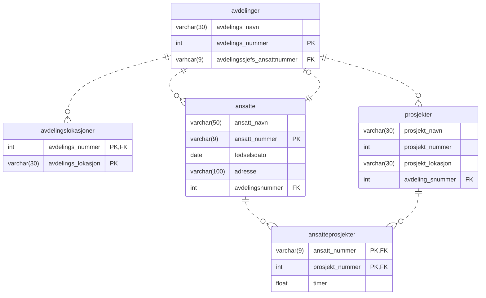
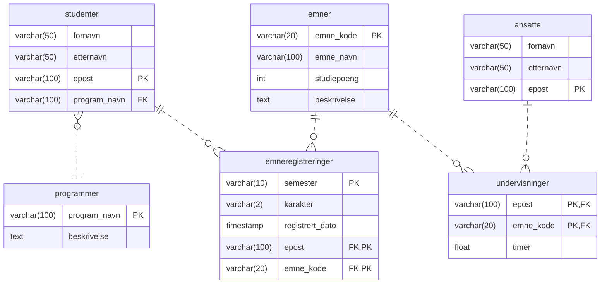
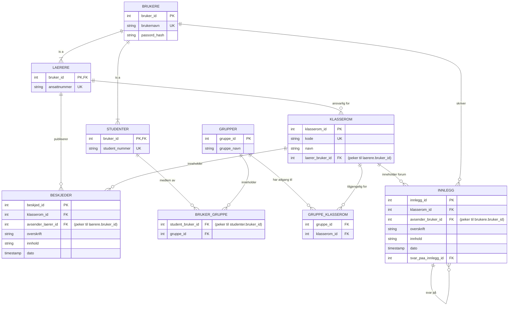

# Begreper
- **relation schema** tilsvarer en tabell/relasjon mens entitet er det skjema skal beskrive? vi bruker **skjema** i dette dokumentet når vi snakker om *relational schema*.
- tips: ikke kombinere attributter fra flere entitetstyper og "relasjonstyper" i én relasjon; i tilfellet én relasjon blander attributter fra flere entiteter og sammenheng (avhengighet, funksjonell avhengighet!?) mellom attributter (brukes *relationships* på engelsk) vil det resultere i semantisk tvetydighet (dvs. det blir vanskelig å forklare)
- det er lett å bli forvirret om begrepene, - her er noen betraktninger, som kan hjelpe å være presis når man betrakter dette:
    - en entitet kan sammenlignes med et objekt ansatt:Per,Iversen,1988-08-25
    - en entitetstype kan sammenlignes med en klasse, - ansatte
    - en ansatt er en forekomst av typen / klassen ansatte
    - **relation** og **relationship** må ikke forveksles, - relation er en en kombinasjon av relaterte attributter i en tabell, mens en relationship er et forhold mellom tabeller/relasjoner
    - det er ikke spesielt intuitivt å si at **ett forhold er en relasjon mellom relasjoner**; kanskje bedre **ett forhold er en forbindelse mellom relasjoner** eller **ett forhold viser til en logisk sammenheng mellom to tabeller**
    - begrepet **relasjonell** i uttrykket **den relasjonelle modellen** viser til en mengde attributter som er *relatert*

# Normalisering (11.2.26)
- relasjonsskjema har en rekke attributter
- relasjonelt databaseskjema har et antall relasjonsskjemaer
- en antagelse at attributter er gruppert for å formere relasjonsskjema ved at en databasedesign (du) bruker sunn fornuft eller ved å lage en mapping av database skjema design fra en konseptuell datamodell som ER eller utvidet-ER datamodell
- trenger en formell måte analysere hvorfor en måte å gruppere attributter i relasjonsskjema skulle være bedre enn et annet
- hvorfor en gruppering av attributter i et relasjonsskjema er bedre enn et annet?
- kan diskutere hvor bra et skjema er på to nivåer
    - det logiske eller konseptuelle nivået (hvordan brukere interpreterer skjema og meningen til attributtene? "gode" skjemaer på dette nivået gir brukere mulighet til å klart forstå meningen av data i relasjoner, og derfor formulere spørringer korrakt)
    - implementasjons (eller fysisk lagrings nivå (hvordan er tupler i basis relasjon lagret og oppdatert)
- "bottom-up" eller "top-down" tilnærming, nesten umulig
- "top-down", - analyse av relasjoner som er "naturlige" (brukes i den "reelle" verden), for eksempel, i en ordre, en form eller en rapport
- man analyserer relasjoner hver for seg og sammen, inntill de nødvendig egenskapene (hvilke egenskaper?) er oppnådd
- målet med relasjonell databasedesign er å produsere en mengde med relasjoner
- implisitt betyr det informasjons-(opp-)bevaring og minimal redundans
- Det er krevende å kvantifisere informasjon, så vi ser på informasjons-(opp-)bevaring som å opprettholde alle konsepter, inkludert attributt-typer, entitetstyper og forholds-typer samt generaliserings/spesialiserings-forhold, som er beskrevet når man bruker en modell som utvidet-ER.
- Minimalisering av redundans innebærer å minimalisere redundant lagringsplass av den samme informasjonen og å redusere behov for flere oppdateringer for å opprettholde konsistens over flere kopier av den samme informasjonen som en respons til hendelser i den "reelle" verden, som krever `innsetting av nye data` og oppdatering. 
- La oss prøve å si hva er "gode" og "ikke gode" relasjonsskjemaer (forholdsskjemaer?). 4 uformelle rettningslinjer for å bedømme kvalitet på design av skjemaer:
    - (1) forsikre seg at semantikken av attributter er klar i skjema
    - redusere redundant informasjon i tupler
    - redusere NULL-verdier i tupler
    - forby mulighet for generering av falske tupler
- Disse rettningslinjene er ikke alltid uavhengige av hverandre.
- En relasjon kan interpreteres som en mengde av fakta. 
- Jo enklere er det å forklare semantikken til en relasjon, desto bedre vil kvaliteten til skjema være. 
- bedrifter: ansatte(navn,fødselsdato,fødselsnummer,adresse,avdelingsnummer)
- avdelingsnummer er et fremmednøkkel som representerer et implisitt forhold mellom ansatte og avdelinger
- semantikken mellom skjemaer for avdelinger og prosjekter er også klar, - hver tuppel i avdelinger representerer en avdelingsentitet, og hvert tuppel i prosjekter representerer en prosjektentitet; 


## RL1: Klar semantikk
- [RETTNINGSLINJE 1 for en "god" modell]
- (1) forsikre seg at semantikken av attributter er klar i skjema
    - Designe skjema slik at det er enkelt å forklare dets mening. Ikke kombiner attributter fra flere entitetstyper og forholdstyper i én relasjon. Intuitivt, hvis et skjema beskriver en entitetstype eller en relasjonstype, skal det være "enkelt" å forklare skjemaets mening. 
- "relation schema" tilsvarer en tabell/relasjon mens entitet er det skjema skal beskrive? vi bruker "skjema" i dette dokumentet når vi snakker om "relational schema"
- EKSEMPEL (rettningslinje #1):
    - ansatteavdelinger(ansatt_navn,ansatt_nummer,adresse,avdelings_nummer,*avdelings_navn*,*avdelingssjef_nummer*); bruker forkortelsen ANSAVD
    - ansatteprosjekter(avdelings_nummer,prosjekt_nummer,timer,*ansatt_navn*,*prosjekt_navn*,*prosjekt_lokasjon*); bruker forkortelsen ANSPRO
    - en slik modell er logisk korrekt og kan forklares, men det bryter med anbefalingen om å ikke blande attributter fra flere **entiteter i den reelle verden**
    - ANSAVD blander attributter fra ANS og AVD
    - ANSPRO blander attributter fra ANS og PRO
    - Hvorfor er ANS, AVD og PRO eniteter fra den reelle verden? (dette bør forklares bedre ...)
    - kan også bruke eksempler fra Oppgavesett 1.4 (for eksempel, kan nevne blanding av rolle inn i brukere relasjonen når man ikke bruker subtyper; eller henvise til et annet eksempel student(student_nummer,grupper_id,gruppe_navn) hvor man blander attributter fra eniteter student og gruppe i en entitet)
    - slike "uklare" entiteter kan brukes som visninger (en. views), men ikke som base-relasjoner 
    - bruker begrepet "basis-relasjon" for en relasjon som inneholder attributter som henger sammen i en reell verdens kontekst og gir mening til en gruppe mennesker, som er relatert til datainnsamling og datalagring om disse entitetene; hvor stor en slik gruppe av mennesker er, avhenger av hvor generelle/universelle modellene vi jobber med er
    - eksemplene på entitetene som de fleste av oss kjenner til er **ordrer**, **fakturaer**, **kontoer** (både i bank og i diverse digitale appllikasjoner), **ansatte**/**studenter**/**kunder**/**personer**/**utøvere**/**elever**/**lærere**/**ledere**/**administratorer**, **firmaer**, **organisasjoner** (ofte for generell entitet), **avdelinger**, **betalinger**, **eiendomer**, **biler**, **fly**, **sykler**, **reiser**, **treninger**, **kropper** (kan relateres til en mer generell entitet **helser**), **matprodukter**, **bomstasjoner**, **butikker**, **websider**, **apper**, ...
- Et av formålene er å **redusere lagringsplass brukt av basis-relasjoner** (og med det også for de relaterte filene).
- Gruppering av attributter i skjemaer, eller måten attributter grupperes i skjemaer, har effekt på hvor mye lagringsplass et skjema vil trenge.
- vis eksempel-tabeller ...
- hvis man lagrer natural "joins" av basis-relasjoner, får man flere problemer, kalt **oppdateringsanomalier**.
- oppdateringsanomalier kan bli klassifisert som 
    - innsettingsanomalier
    - slettingsanomalier
    - modifikasjonsanomaliser (oppdateringsanomalier?)
- **innsettingsanomalier** kan igjen deles inn i to typer:
    - for å sette inn en tuppel med data for en ny ansatt vi må inkludere enten attributtverdier for avdeling, som en ansatte jobber i, eller NULL-er (hvis en ansatt jobber ikke for en avdeling ennå)

## RL2: INS-, DEL-, MOD-anomalier
- [RETTNINGSLINJE 2 for en "god" modell]
- (2) Designe skjemaer for basis-relasjoner slik man unngår INS-, DEL- eller MOD-anomalier i relasjoner. Hvis man kan ikke unngå anomalier, beskriv disse detaljert og sørg for at programmer som skal oppdatere databasen tar hensyn til dem.


## RL3: NULL verdier i tuplene
- [RETTNINGSLINJE 3 for en "god" modell]
- Ofte (spesielt for å gjenspeile den reele verden) desinger man skjema slik at man får en "fet" relasjon. Hvis flere av attributtene gjelder ikke alle tupler i relasjonen, blir det en del NULL-er i disse tuplene. Dette kan føre til sløsing med lagringsplass, problemer med forklaring av mening til attributtene og en spesifikasjon av JOIN operasjoner på et logisk nivå (inner og outer joins vil gi forskjellige resultater når NULL-verdier er involvert i joins; man må være oppmerksom på at forskjellige typer joins kan gi forskjellige resultater; dette kan gi mening for avansert brukere og de som har designet modellen, men dette kan gi problemer for andre
- (3) Unngå, hvis mulig, å plassere verdier i basis-relasjoner, hvis verdier ofte skal være NULL. Hvis det ikke er mulig å unngå NULL-er, sørge for at de fremkommer bare i spesifikke tilfeller og gjelder ikke de fleste tuplene i relasjonen (eksempel fra bysykkeluleie med laas_id og stasjons_id som NULL-verdier hvis sykkelen utleid, er med vilje gitt for å illustrere brudd på rettningslinjen #3).

## RL4: Feil i tupler under joins
- [RETTNINGSLINJE 4 for en "god" modell]
- (4) Designe skjema slik at de kan kobles sammen med likhets-betingelser på attributter som er passende relaterte (PK, FK) par på en slik måte som garanterer at det ikke blir generert "tvilsomme" tupler (i de resulterende relasjoner etter joins). Unngå relasjoner som er matsjet på attributter som ikke er (logiske! reelle fra verden modellert i modellen med PK og FK) kombinasjoner, fordi a joins på slike attributter kan resultere i "tvilsomme" tupler.
- 
```sql
create table ansproorig as select * from (select ansatteprosjekter.ansatt_nummer, ansatteprosjekter.prosjekt_nummer, timer, ansatte.ansatt_navn, prosjekter.prosjekt_navn, prosjekter.prosjekt_lokasjon from ansatteprosjekter join prosjekter on ansatteprosjekter.prosjekt_nummer = prosjekter.prosjekt_nummer join ansatte on ansatte.ansatt_nummer = ansatteprosjekter.ansatt_nummer) as rel_ansproorig;
--
select ansatt_navn, prosjekt_lokasjon from ansatte 
join ansatteprosjekter 
    on ansatte.ansatt_nummer=ansatteprosjekter.ansatt_nummer 
join prosjekter 
    on ansatteprosjekter.prosjekt_nummer=prosjekter.prosjekt_nummer;
--
create table anslok as select * from (select ansatt_navn, prosjekt_lokasjon from ansatte join ansatteprosjekter on ansatte.ansatt_nummer=ansatteprosjekter.ansatt_nummer join prosjekter on ansatteprosjekter.prosjekt_nummer=prosjekter.prosjekt_nummer) as rel_anslok; 
--
select ansatteprosjekter.ansatt_nummer,
       ansatteprosjekter.prosjekt_nummer,
       timer,
       prosjekter.prosjekt_navn,
       prosjekter.prosjekt_lokasjon
from ansatteprosjekter 
join prosjekter on ansatteprosjekter.prosjekt_nummer = prosjekter.prosjekt_nummer;
--
create table anspro as select * from (select ansatteprosjekter.ansatt_nummer, ansatteprosjekter.prosjekt_nummer, timer, prosjekter.prosjekt_navn, prosjekter.prosjekt_lokasjon from ansatteprosjekter join prosjekter on ansatteprosjekter.prosjekt_nummer = prosjekter.prosjekt_nummer) as rel_anspro;
-- denne vil ikke gi tilbake ansproorig (mange ugyldige tupler)
select * from anspro natural join anslok; 
``` 
- Dette bør man sjekke for en design:
    - Anomalier som forårsaker ekstraarbeid under innsetting og modifikasjon av data i en relasjon, og som kan forårsake uheldig informasjonstap under sletting av data fra en relasjon.
    - Sløsing med lagringsplass grunnet NULL-verdier og vanskeligheter med å utføre spørringer, aggregeringsoperasjon og joins pga. NULL-verdier.
    - Generering av ugyldige / ikke korrekte tupler ved å bruke joins på basis-relasjoner på matsjende attributter som ikke er PK eller FK og dermed ikke produserer en gyldig relasjon.

## Funksjonell avhengighet (FD)
- La oss se på funksjonell avhengighet, - en formell begrensning mellom attributtene, som er grunnlaget for et formelt verktøy for å formelt måle egnethet av grupperinger av attributter i et relasjonsskjema (forholdsskjema).
- Gode normalformer er definert for tilfredsstille en mengde med ønskede begrensninger ved å bruke primærnøkler og funksjonelle avhengigheter.
- En funksjonell avhengighet er en begrensning på to mengder av attributter fra en database. 
- Anta at et skjema har n attributter A1, A2, ..., An. 
- La oss forestille oss at en hel database kan beskrives av en univeral skjema R = {A1, A2, ..., An} (dvs. vi kunne tenke oss at hele databasen blir da representert med kun en tabell, men foreløpig bruker vi dette kun for å beskrive en formell teori for avhengigheter i data).
- DEFINISJON: En **funksjonell avhengighet**, betegnet med X->Y, mellom to mengder av attributter X og Y som er delmengder av R spesifiserer en *begrensning* på mulige tupler, som kan forme en relasjonstilstand r av R. Begrensningen er at for enhver par av tupler t1 og t2 i r, som har t1[X]=t2[X], må også gjelde t1[Y]=t2[Y]. 
- Med andre ord betyr dette at verdier i Y-komponenten av en tuppel i r avhenger av, eller er *bestemt av*, verdier i X-komponenten til samme tuppel.
- Alternativt, verdier i X-komponenten av en tuppel unikt (eller **funksjonelt**) *bestemmer* verdier i Y-komponentene til tuppelen.
- Eller, vi kan også si at det er en funksjonell avhengighet mellom X og Y, eller at Y er funksjonelt avhengig av X.
- Ofte forkortes **functional dependency** (på norsk funksjonell avhengighet) med **FD** eller **f.d.**. 
- Mengden med attributter X, blir kalt "venstrehånds-side" av FD, mens Y blir kalt "høyrehånds-side" av FD.
- Hvis en begrensning på R tilstander hevder at det kan ikke finnes mer en en tuppel med en gitt X-verdi i hver instans av relasjonen r(R), dvs. X er en kandidatnøkkel av R, antyder det også at X->Y for enhver delmengde av attributter Y av R (fordi at nøkkenbegrensningen antyder at ingen to tupler i envher tillatt tilstand r(R), kan ha samme verdien av X). 
- Hvis X er en kandidatnøkkel av R, so X->R (R, dvs. en universell skjema, er funksjonelt avhengig av X).
- At Y er funksjonelt avhengig av X i R, sier ikke noe om X er funksjonelt avhengig Y i R.
- FD er en egenskap av semantikken eller meningen til attributter.
- En databasedesigner bruker deres forståelse av semantikken av attributtene i R, dvs. hvordan de er relatert til hverandre, til å spesifisere funksjonelle avhengigheter som skal holde for alle relasjonstilstander (utvidelser) r av R. 
- Utvidelser til relasjonen r(R) som tilfredsstiller FD-begrensninger, blir kalt for "lovlige" (engelsk *legal*) relasjonstilstander (eller "lovlige" utvidelser). 
- Hovedformålet med FD er å beskrive et skjema R ved å spesifisere begrensninger på skjemaets attributter som må alltid gjelde (være tilfredsstilt).
- {fylke, førerkort_nummer} -> fødselsnummer (i USA)
- "by design": {fødselsdato, århundre, kjønn, formel} -> fødselsnummer (i Norge http://fnrinfo.no/info/oppbygging.aspx)
- prosjekt_nummer -> {prosjekt_navn, prosjekt_lokasjon}
- måter å uttryke en FD på:
    - prosjekt_nummer **unikt bestemmer** prosjekt_navn og prosjekt_lokasjon
    - prosjekt_navn og prosjekt_lokasjon er **funksjonelt bestemt av** eller **funksjonelt avhengig av** prosjekt_nummer 
    - **gitt verdien av** prosjekt_nummer, **kjenner vi til verdiene av** prosjekt_navn og prosjekt_lokasjon
- FD er en egenskap til relasjonsskjema R, ikke en spesifikk "lovlig" relasjonstilstand r av R.
- Derfor, FD kan ikke bli "automatiks" avdekket med å bare se på en tuppel, den må bestemmes eksplisitt av noen som kjenner semantikken til attributtene i R. 
- Det er nok med å finne en moteksempel i data, som ikke tilfredsstiller den foreslåtte FD, for å forkaste FD. 
- For eksempel, hvis vi har designet en relasjon for lærere og emner de underviser, og sagt at laerer_fullt_navn -> emne_navn er en FD (dvs. laerer_fullt_navn unikt bestemmer emne_navn), så det faktum at laerer_fullt_navn = "Jon Olsen" underviser både emne_navn="Datastrukturer" og emne_navn="Databasesystemer", stadfester at det ikke er en funksjonell avhengighet mellom laerer_fullt_navn og emne_kode.
- Med andre ord, eksistens av FD kan ikke garanteres før man *forstår* meningen av de aktuelle attributtene, men vi kan med sikkerhet si at en FD ikke holder, hvis det finnes tupler som ikke tilfredsstiller FD.

|A|B|C|D|
|--|--|--|--|
|a1|b1|c1|d1|
|a1|b2|c2|d2|
|a2|b2|c2|d3|
|a3|b3|c4|d3|


- Ved å se på denne utvidelsen r av relasjonen R, kan vi foreslå at det finne følgende FD-er:
    - B -> C (tupler: (b1,c1),(b2,c2),(b2,c2),(b3,c4))
    - i denne utsnitten, så bestemmer B unikt C 
    - C -> B (det motsatte er også lovlig i dette tilfelle)
    - {A,B} -> C
    - {A,B} -> D
    - ikke A -> B (tupler: (a1,b1) og (a1,b2) gjør FD ugyldig, dvs. A bestemmer ikke B unikt
    - ikke B -> A
    - ikke D -> C

- Viser B -> C

|A|B|C|D|
|--|--|--|--|
|a1|**b1**|**c1**|d1|
|a1|**b2**|**c2**|d2|
|a2|**b2**|**c2**|d3|
|a3|**b3**|**c4**|d3|

- en måte å diagrammatisk uttrykke FD for et relasjonsskjema:
```
Ename, Ssn, Bdate, Address, Dnumber, Dname, Dmgr_ssn
  ^     |     ^       ^        ^       ^       ^ 
  |     |     |       |        |       |       |
  ------------------------------       |       |
                               |       |       |
                               -----------------
``` 
- Vi betegner en mengde med funksjonelle avhengigheter i et skjema med **F**.
- Skjemadesigner vanligvis spesifiserer FD som er semantisk åpenbare.
- Vanligvis en mengde med andre lovlige FD finnes også i skjema, og disse kan blir utledet fra de åpenbare FD-ene.
- Slike FD-kan enten blir utledet (logisk argumentasjon basert på fakta, "deduced") eller antatt (ha en mening eller gjette basert på bevis eller argumentasjon, "infrerred").

- 


## Normalformer
- Normalformer og normaliseringsprosess ved å bruke funksjonelle avhengigheter.
- En normasliseringsprosess består av å anvende en rekke tester på relasjoner for å møte disse stadig strengere kravene og dekomponere relasjonene når det er nødvendig.
- Praktiske desingprosjekter har to vanlige tilnærminger:
    - utføre en konseptuelt skjemadesign ved å bruke en konseptuell modell som ER eller EER og mappe dette designe i en mengde av relasjoner
    - designe relasjoner basert på en intern kunnskap som er utledeet fra eksisterende implementasjoner i filer, former eller rapporter
- En vesentlig del av dette er også basert på intusjon bak normalformer for relasjonsskjemaer.

- Codd først introduserte begrepene rundt normaliseringsprosessen rundt 1972. 
- Poenget var å ta et skjema gjennom en del tester, for å verifisere om den tilfredsstiller en spesifikk *normalform*. 
- Kan betraktes som *analystisk relasjonsdesign*. 
- Codd foreslo 3 normalformer, - 1NF, 2NF og 3NF.
- Senere dfinerte han sammen med Boyce "Boyce-Codd normarform" eller BCNF, som er en "strengere" definisjon av 3NF. 
- Alle normalformer er basert på et analytisk verktøy: FD mellom attributtene til en relasjon.
- Senere ble også 4NF og 5NF introdusert, basert på flerverdi avhengigheter og join-avhengigheter.
- Normalisering av data kan betraktes som en analytisk prosess basert på FDs til skjemaer og primærnøkler for å oppnå ønskede egenskaper til skjemaer: 
    - minimal redundans
    - minimalt med INS-, DEL- og MOD-anomalier
- Kan betraktes som en filtrerings- eller renselses-prosess for å forbedre designkvaliteten.
- Et ikke tilfredsstillende skjema, som ikke tilfredsstiller de nevnte egenskapene (min. redund. og uten anomalier), blir delt opp i mindre skjemaer, som inneholder en delmengde med attributtene fra den ikke tilfredsstillende skjema, og disse mindre skjemaer tilfredsstiller krav om minimal redundans og fravær av anomalier. 
- Verktøy for databasedesignere for en "god" normaliseringsprosess:
    - rammeverk for å analysere skjema basert på nøkler og FD mellom attributtene
    - en rekke med normalform-tester, som utføres på hver relasjon, slik at relasjonsdatabase kan bli normalisert til ønsket form
- DEFINISJON (meget lite nyttig!): En normalform av en relasjon refererer til den høyeste normalform-betingelse den tilfredsstiller, og herved indikerer graden til hvilket den har blitt normalisert til. 
- Normalformer alene garanterer ikke en god databasedesign. 
- I tillegg må man også være oppmerskom på føgende 2 egenskaper:
    - ikke-additiv join eller tapsfri join egenskap, som garanterer at "ugyldige / ukorrekte" tupler ikke blir generert i skjemaer etter dekomposisjon (oppdeling) **DETTE ER MEGET VIKTIG**
    - avhengighets-oppretholdelses egenskap, som forsikrer at hver FD er representert i en egen relasjon etter dekomposisjon (oppdeling av det ikke-tilfresstillende skjemaet) **ØNSKELIG, MEN KAN IGNORERES I NOEN TILFELLER**

- Det er vanlig at designprosjekter i både private og offentlige bedrifter involverer noen eksisterende designer, og formålet er ofte å utbedre designet basert på eksisterende design.
- 4NF og 5NF har "harde" betingelser og er ofte også vanskelig å forstå for brukere og designere.
- I praksis er det vanlig med en normalisering opp til 3NF og BCNF. 
- Av og til kan man også la relasjoner være i 2NF, for å oppnå bedre ytelse.
- DEFINISJON: **Denormalisering** er en prosess for å lagre join av relasjoner av høyere normalform som en basis-relasjon, som da har en lavere normalform.
- DEFINISJON
    - En **supernøkkel** av et skjema R = {A1, A2, ..., An} er en mengde attributter S tihører R, med den egenskapen at ingen to tupler t1 og t2 i envher lovlig tilstand for relasjonen r av R skal tilfredsstille t1[S]=t2[S]. En **nøkkel** K er en supernøkkel med en ekstra egenskap at hvis man fjerner en hvilken som helst attributt fra K, vil K ikke lenger være en supernøkkel.
- Forskjellen på en nøkkel og en supernøkkel er at nøkkel må være **minimal**. 
- EKSEMPEL: {ansatt_nummer} er en nøkkel for *ansatte*, mens {ansatt_nummer}, {ansatt_nummer, ansatt_navn}, {ansatt_nummer, ansatt_navn, fødselsdato} og envher annen mengde av attributter, som inneholder {ansatt_nummer}, er supernøkler.
- Hvis et skjema har mer enn én nøkkel, blir alle nøklene kalt for **kandidatnøkler**. En av kandidatnøklene blir valgt som **primærnøkkel**. 

### 1NF
- 1NF er en del av den formelle definisjonen av en relasjon i en grunnleggende (flat) relasjonsmodell.
- Historisk, ble den definert for å unngå flerverdiattributter `A,B,C`, kompositte/sammensatte attributter `navn etternavn` og en blanding av disse (også avledede attributter bør unngås, dvs. attributter, som kan beregnes fra andre attributter).
- En kolonne må inneholde kun atomære (enkle, ikke delbare) verdier. 
- 1NF ikke tillater relasjoner inn i relasjoner og relasjoner som attributtverdier i tupler. Kun enkle atomære verdier er tillatt (er 7:00,4 en tillatt verdi?). 
- Se eksempler i eget dokument (regnark)
- Oppgave: 
- Gjør denne relasjonen til 1NF:
    - kandidater (personnummer, navn, {jobb_historikker (bedrift, hoyeste_stilling,
{salgs_historikker (aar, beste_salg)})})
- Løsning
    - kandidater_1 (personnummer, navn)
    - kandidater_jobb_historikker (personnummer, bedrift, hoyeste_stilling)
    - kandidater_salgs_historikker (personnummer, bedrift, aar, beste_salg)
- Det er ikke uvanlig å lagre BLOB (binary large object) og CLOB (character large object) i databaser.
- I disse tilfellene blir hele objektet betraktet som en atomær verdi og vil ikke ødelegge 1NF.


### 2NF
- 2NF er basert på konseptet **full funksjonell avhengighet**.
- En funksjonell avhengighet er en full funksjonell avhengighet hvis etter at hvilken som helst av attributtene A blir fjernet fra X, blir den funksjonelle avhengigheten brutt. 
- DEFINISJON: Et attributt til relasjonsskjema R kalles et primattributt til R hvis det er medlem av en kandidatnøkkel til R. Et attributt kalles ikke-primattributt hvis det ikke er et primattributt – det vil si hvis det ikke er medlem av noen kandidatnøkkel.
- DEFINISJON: Et skjema R er i 2NF hvis hvert ikke-primattributt A i R er fullt funksjonelt avhengig av primærnøkkelen i R. 
- Tester FD-er hvis venstrehånds-attributter er en del av primærnøkkelen.
- EKSEMPEL
```
 Ssn, Pnumber, Hours, Ename, Pname, Plocation
  |     |        ^       ^     ^       ^
  |     |        |       |     |       |   
  ----------------       |     |       |
  |                      |     |       |
  ------------------------     |       |
        |                      |       |
        --------------------------------
``` 
- Enkelt sagt: Ename og {Pname, Plocation} er funksjonelt avhengig kun av en del av primærnøkkelen.
- Normalisering fører til tre skjemaer, som hver er på 2NF
``` 
 Ssn, Pnumber, Hours   Ssn, Ename   Pnumber, Pname, Plocation
  |     |        ^       |     ^       |       ^         
  |     |        |       |     |       |       |         |
  ----------------       -------       -------------------
``` 


- Generelle definisjoner av normalformer, som kan anvendes på envher gitt design og krever ikke en steg-etter-steg analyse av normalisering.

- 5-te normalform, flerverdi-avhengighet (MVD) og join-avhengighet (JD)
- Ikke-additiv join egenskap og funksonell avhengighets bevarings egenskap. 


### 3NF
- 3NF er basert på konseptet **transitiv avhengighet**
- En funksjonell avhengighet i en relasjon R er en transitiv avhengighet hvis det finnes en mengde med attributter Z i R, som er hverken en kandidatnøkkel eller en delmengde av hvilken som helst nøkkel av R (Z kan være en delmengde av en kandidatnøkkel), og både X->Z og Z->X er tilfredstilt. 
- Avhengighet mellom ansatt_nummer og avdelingssjefs_ansattnummer er transitiv mellom avdelings_nummer i avdelinger, fordi at både ansatt_nummer -> avdelings_nummer og avdelings_nummer -> avdelingssjefs_ansattnummer holder og avdelings_nummer er ikke en nøkkel selv eller en delmengde av en nøkkel i avdelinger.
- Normalisering:
```
Ename, Ssn, Bdate, Address, Dnumber, Dname, Dmgr_ssn
  ^     |     ^       ^        ^       ^       ^ 
  |     |     |       |        |       |       |
  ------------------------------       |       |
                               |       |       |
                               -----------------
```  
```
Ename, Ssn, Bdate, Address, Dnumber   Dnumber, Dname, Dmgr_ssn
  ^     |     ^       ^        ^         |       ^       ^
  |     |     |       |        |         |       |       |
  ------------------------------         -----------------
                               
``` 
- praktisk eksempel
```sql 
select an.ansatt_navn as avdelings_leder, av.avdelings_navn 
from ansatte an 
join avdelinger av 
on an.avdelingsnummer = av.avdelings_nummer 
where an.ansatt_nummer = av.avdelingssjefs_ansattnummer;
--
 avdelings_leder |  avdelings_navn   
-----------------+-------------------
 Ole Hansen      | IT-avdelingen
 Per Olsen       | Salgsavdelingen
 Erik Johansen   | Økonomiavdelingen
 Thomas Larsen   | HR-avdelingen
(4 rows)
``` 

### Boyce-Codd Normal Form
- Var original foreslått som en forenkling av 3NF, men har vist seg til å være mer restriktiv.
- Hver relasjon i BCNF er også i 3NF, men en relasjon i 3NF er ikke nødvendigvis i BCNF. 
- En relasjon er i BCNF hvis enhver determinant (en attributt som bestemmer en annen attributt) er en supernøkkel. Eller, enhver minimal determinant er en kandidatnøkkel. 
- Eksempel: 
- Følgende er en relasjon i 3NF (alle attributt-verdier atomære, ingen attributter som kun avhenger av en del av nøkkelen, ingen attributter som avhenger av noe som ikke er nøkkelen):

|Student |Emne    |Ansatt (foreleser/lærer)|
|--|--|--|
|Narayan |Database    |Mark|
|Smith   |Database    |Navathe|
|Smith   |Operating Systems   |Ammar|
|Smith   |Theory  |Schulman|
|Wallace |Database    |Mark|
|Wallace |Operating Systems   |Ahamad|
|Wong    |Database    |Omiecinski|
|Zelaya  |Database    |Navathe|
|Narayan |Operating Systems   |Ammar|

- FD1: {Student, Emne} -> Ansatt
- FD2: Ansatt -> Emne (betyr at hver foreleser underviser kun ett emne)
- Kandidatnøkkel: {Student, Emne}
``` 
 Student, Emne,  Foreleser
  |        |        ^    
  |        |        |     
  ------------------- 
           ^        |
           |        |
           ---------- 
``` 
- Denne relasjonen er i 3NF, men ikke i BCNF. 
- Følgende dekomposisjon (oppdelinger) gir BNCF
    - relasjon1(Foreleser, Emne) og relasjon2(Foreleser, Student)

- Eksempel (fra pensumboken side 245 i 5. utgave):
- forestillinger(kinosal, dato, klokkeslett, filmnr)
- FD1: {kinosal, dato, klokkeslett} -> filmnr 
- FD2: filmnr -> kinosal (en film blir alltid vist i samme kinosal)

- Her er en sammendrag om 3NF og BCNF generert av Manus.im (KI-verktøy):

| Aspekt                  | 3NF                             | BCNF                                         |
| ----------------------- | ------------------------------- | -------------------------------------------- |
| **Kompleksitet**        | Enklere å forstå                | Mer kompleks                                 |
| **Praktiske problemer** | Sjelden                         | Veldig sjelden                               |
| **Antall tabeller**     | Færre                           | Ofte flere                                   |
| **Join-ytelse**         | Færre joins nødvendig           | Flere joins nødvendig                        |
| **Ikke-additive joins** | Sjelden hvis riktig normalisert | Sjelden hvis riktig normalisert              |
| **Når det lønner seg**  | 99% av tilfellene               | Spesielle tilfeller med flere kandidatnøkler |
 

# Studieeksempel
Eksemplet vi har brukt før under forelesninger. 
Jeg har tatt ut tidsstempel for hver tuppel i tabeller hvor dette ikke er strengt tatt nødvendig.



# Eksempel fra Oppgavesett 1.4



# Referanser
Elmrasi & Navathe. 2016. "Fundamentals of Database Systems". 7th Edition.
