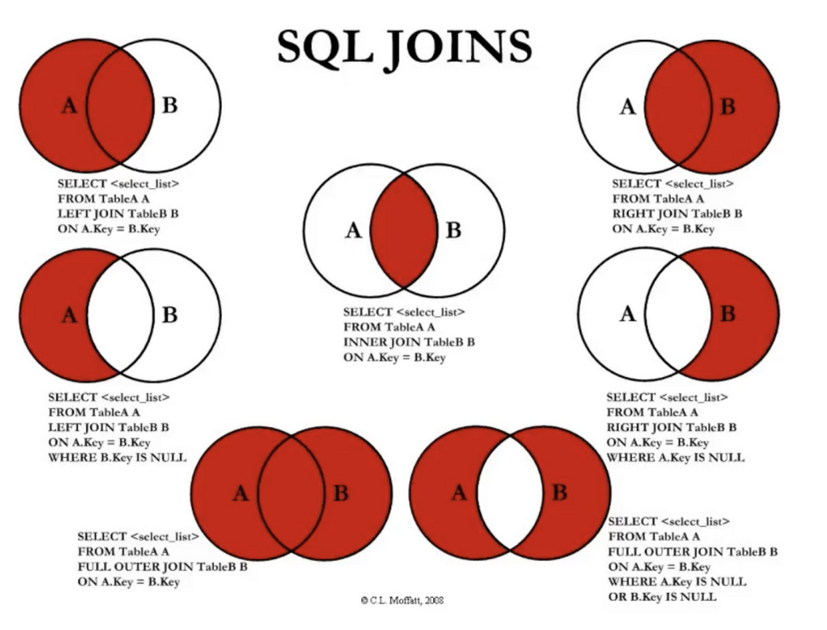

# SQL I (første del 25-Feb-2026)
- Påstand: læring for dagens datastudenter domineres av kodefragmenter, som man kan generere i løpet av millisekunder ved hjelp av GTP-tjenester.
- Det kan være nyttig i spesifikke tilfeller men slike "atomiske" (ikke delbare eller "slukt" som en fullstending løsning) fragmenter, men man må også huske på at de er kun små biter av et større puslespill. 
- Systemutvikling er mer enn ren koding for å prosessere data. 
- Applikasjonsutvikling er en "never-ending story" (nye krav oppstår fortløpende og må implementeres i eksisterende / utførende systemer).

- Applikasjoner må ofte 
    - skalere for et stort antall (millioner) brukere;
    - være brukbare / responsive for brukere;
    - ha en klar struktur og dokumentasjon slik at dataingeniører og designere kan legge til nye funksjoner når det oppstår nye bruksmønstre.

- For å kunne oppnå dette må dere knytte sammen forskjellige konsepter som 
    - SQL databaser,
    - datamodeller,
    - nøkkel-verdi lagre, 
    - databeskyttelse. 

- For å lage en "kjapp" applikasjon trenger dere ha en god forståelse for
    - optimalisering av spørringer,
    - rad- og kolonne-lagre,
    - sortering,
    - hashing,
    - indeksering.

- Hver bit er en bit i et puslespill, og bitene må passe sammen for å kunne lage en brukbar applikasjon for brukere. 

- La oss illustrere grunnlegende SQL-spørringer med et praktisk eksempel for en strømmetjeneste (som Spotify, for eksempel).
- Entiteter for en strømmetjeneste for musikk kan være **spillelister**, **sanger**, **sangtekster**, som lagres både i nøkkel-verdi lagre og SQL databaser.
- Spørringer mot en database for strømming av musikk kan optimaliseres ved hjelp av rad- og kolonne-lagre, sortering, hashing og indeksering. Komplekse datatyper som text og geodata håndteres med innlemninger (representajon av ord og setninger i en kontinuerlig vektorrom), hashing og indeksering ved bruk av vektordatabaser. 
- Det er også viktig å kunne implementere inkrementelle oppdateringer (applikasjon som en "never-ending story"). 
- Hvordan takle utfordringer når man skal selge millioner av billetter til en konsert? Hva er ACID egenskaper og hvordan manifistererer disse seg i praksis? Hvordan unngå å selge at den samme billetten blir ikke solgt flere ganger og at kjøperen blir garantert billetten i den kjøperen har betalt for den? 
- Kan man bygge et "trygt" transaksjonssystem ved hjelp av parallell programmering, låsing og logging? 
- Big Data: 
    - Hvordan skalerte Discord for lagring av milliarder meldinger til lagring av billioner meldinger i løpet av fem år?
    - Google Ads database fra 10 MySQL databaser i 2003 til SQL-basert Spanner system i 2023
    - Hvordan dele opp data i håndterbare mengder (partisjoner) for å kunne bygge KI-systemer rundt terabytes til petabytes av data?
    - Hvordan kan man bruke kunnskap om distribuerte systemer, publisher-subscriber, meldingskøer og verktøy som Kafka for å håndtere problemer som billett-skalpering og bot-angrep?

- **Billett-skalpering**: Refererer til praksisen med å kjøpe billetter (ofte til konserter eller sportsarrangementer) for deretter å selge dem videre til høyere priser. (generert av Duck.ai)
- **Bot-angrep**: Brukes innen cybersikkerhet for å beskrive angrep der automatiserte programmer (boter) brukes til å utføre ondsinnede handlinger, som for eksempel overbelastning av nettsteder eller datainnbrudd. (generert av Duck.ai)

- Hvorfor bruker moderne applikasjoner SQL?
    - eksempler fra mat-bestillingstjenester
    - manipulerer (ofte utenfor allmennetiske oppfatninger) brukere og leverandører (sjåfører) for å generere profit
    - **use case** implementer funksjon for "ofte gjentakende bestillinger", slik at brukeren kan se en liste av tidligere bestillinger med de mest brukte på toppen av listen (bruker SQL, f.eks. *view*)
    - **use case** implementer funksjon for "gruppebestilling" for å bestille for en fest, som viser tidligere gruppebestillinger for andre fester (bruker SQL, f.eks. *view*)
    - sted og status for en matlevering blir registrert ved hjelp av SQL og vist brukere i sanntid
    - restauranter kan planlegge bestilling av matvarer basert på bestillingshistorikker (brukes SQL)
    - SQL kan også brukes for monitorering av status til diverse entiteter i datamodellen
    - SQL kan brukes for å analysere data og hvordan brukere bruker applikasjonen, for å optimalisere bruken
    - SQL kan brukes for å finne de mest populære retter i et geografisk området
    - Men hvordan med påstander om at SQL er for **treg** for mange av disse oppgavene?
    - Det har vært forskjellige sykluser i databehandling de siste 20-30 årene, - "KI vinter", "noSQL bevegelser", "chip-desing vinter" osv. Grunnet til slike "bevegelser" er at noen krav rundt maskinvaren, nettverk og applikasjonsutviklingsprosesser endres og blir funnet opp på nytt rundt noen nye (ofte generelle) konsepter. 
    - 1980-2000: SQL databaser var standard for behandling av data i bedrifter og ble installert på kostbare servere (høy ytelse, spesifikk maskinvare, høy tilgjengelighet, høy skalerbarhet og høy sikkerhet); typiske tjenester, - bank, varehandel og e-commerce.
    - 2000-2005: SQL sliter med den voksende mengden av data fra WWW, slik at nye løsnigner tvinges frem.
    - 2006-2009: Google implementasjoner som Google File System (distribuert filsystem), MapReduce (spesifikk måte å splitte opp store databaser) og BigTable for sine søke- og epost-tjenester. Mange billige datamaskiner (i en nettsky) ble brukt for å kunne håndtere store datamengder og økende antall brukere. 
    - 2010-2015: Diverse NoSQL løsninger blir implementert.
    - 2015-2025: SQL-baserte skalerbare databaser eller distribuerte systemer i nettsky (Googles BigQuery, AWS produkter, Snowflake, Databricks). Databasehåndteringsmotorer har blitt redesignet for å kunne skalere for den nye realiteten. SQL-syntaksen er i stor grad beholdt for de nye tjenestene.
    - SQL ble brukt av over 20 millioner app-utviklere verden rundt i 2023.
    - Et språk, hvor man beskriver hva man trenger istedenfor å beskrive hvordan man skal få det til (tradisjonelle programmeringsspråk), ligner måten KI-prompter funksjonerer på. 
    - Data-orienterte applikasjoner velger en arkitektur hvor mange SQL databaser blir koblet sammen og bruker SQL som en standard, istedenfor å vedlikeholdet mange API lag for utveksling av data.
    - Nøkkel-verdi lagre har blitt mer populære for spesifikke **use cases**.
    - *sharding* er et begrep som beskriver oppdeling av store databaser i mindre deler kalt *shards* for å kunne skalere, ha raskere prosessering av de mest brukte spørringene, håndtere perioder med stor forespørsel bedre; *sharding* kan også kombineres med replikering for å gi raskere tilgang til de mest etterspurte data.
    - Noen av anbefalingene til modern databasedesign er **å starte med relasjonsmodellen tidlig** med en stabil og skalerbar lagringsplass tilgjengelig. Relasjonelle abstraksjoner (i konteksten av relasjonsalgebra, som vi har snakket om tidligere) gjør utviklingen mer effektiv og reduserer kostnader med en forutsigbar migrasjon i fremtiden.
    - Når det gjelder NoSQL, så er den også aktulle som en arkitektur bak SQL-basert grensesnitt, dvs. at SQL-spørringene blir kompiliert for kunne bruke en NoSQL-kjerne. Derfor er det ikke lenger en enten eller valg i forhold til SQL og NoSQL, - begge modellen brukes samtidig for å ta hensyn til den økende datamengden og behovet for skalering for å beholde tilgjengelighet og integritet i dataene.

- Populariteten av diverse strømmetjenester har økt betydelig i de siste årene. 
- Det er flere dominerende applikasjoner på markedet for strømming av musikk, podcasts og annen audio-innhold. 
- Tjenester inneholder mange **use cases** for roller som Sluttbruker, Musikker, Skaper (de som skaper innhold) og Markedsfører. Skapere kan lage innhold og se på diverse statistikker (hvor mange som har lastet ned, hørt på osv.). 
- La oss designe en grunnleggende relasjonell modell for en musikkstrømmetjeneste. Forslaget er å ha 3 grunnleggende entiterer,  - `users`, `songs` og `listenings` (en bruker kan høre på mange sanger og en sang kan bli hørt av mange brukere, dvs. en mange-til-mange relasjon, samt en assosiativ entitet / koblingsentitet `listenings`). Vi bruker denne modellen for å se på eksempler av de enkleste SQL-spørringene.
- I tillegg la oss foreslå en entitet for anbefalinger, eller den engelske navnet `recommendations`. 
- La oss gjenta noen definisjoner som vi har sett på før.
- Et **skjema** er en designplan som definerer struktur og organisering av en database. Skjema inneholder tabellnavn, kolonnenavn, datatyper og definisjon av forhold mellom tabellene. Formålet med et skjema er å presentere en klar og konsistent organisasjon av dataene i database, slik at det er forholdsvis enkelt å administrere, etterspørre og optimalisere data. Et skjema gir også mulighet til å endre databasestruktur når nye krav (nye **use cases**) fra forskjellige brukerroller må tilfredsstilles. 
- En **tabell** er en datakolleksjon, som består av rader og kolonner. Hver kolonne representerer ett spesifikt attributt eller felt, mens hver rad representerer én post eller én instans.
- En **primærnøkkel** er en unik identifikator til hver rad i en tabell. Det forsikrer at det finnes ikke flere rader med nøyaktig samme verdi og gir mulighet til raske søk og oppdateringer av rader. Primærnøkkel hjelper å holde klar og organisert struktur i database. Det gjør at rader kan identifiseres og hindrer duplikater, som kan føre til ikke konsistente data og forvirring. 
- En **sekundærnøkkel** er en ikke unik attributt or mengde av attributter i en database som muliggjør en effektiv tilgang til rader basert på andre verdier enn verdier for primærnøkkel. Navn til musikker kunne vært et sekundærnøkkel, mens musikker id er en primærnøkkel. Dette beskriver kun andre attributter enn primærnøkkel og har ikke direkte med indeksering å gjøre. Dette begrepet brukes ikke ofte i databaselitteratur.
- En **fremmednøkkel** er en kolonne eller en mengde med kolloner i en tabell som peker på en primærnøkkel i en annen tabell. Det brukes for å definere forhold mellom tabeller. Det hjelper til å synkronisere data på tvers av flere tabeller. Ved å referere til primærnøkkel i en annen tabell, sørger fremmednøkkel at data i databasen er konsistent, presis og at man unngår rader uten forhold ("foreldreløse rader").

- `users` tabell inneholder informasjon om hver bruker, som navn og epostadresse. `user_id` er en primærnøkkel, en unikt heltall, som vi velger å bruke for å referere til en bruker. Vi bruker VARCHAR for kortere strenger (opp til 256?) og TEXT for lengre strenger.
- `songs` tabell inneholder informasjon om hver sang, som en identifikater som også er en primærnøkkel, en tittel, en artist (musikker) og en sjanger (som kan betraktes som ikke unike sekundærnøkler). 
- `listenings` tabell inneholder en rad for hver gang en bruker hører på en sang og har kolonner som `listen_id` (primærnøkkel), `user_id`, `song_id` og tiden når brukeren hørte på sangen. Tabellen har også fremmednøkler til `users` og `songs`. Hver `user_id` i `listenings` må referere til / peke på en `user_id` i `users`. Hver `song_id` i `listenings` må peke på en `song_id` i `songs`.
- Vi setter også inn testdata i alle tabellene. For eksempel, i tabellen `users` Mickey har en brukeridentifikator `user_id = 1` og mickey@example.com er brukerens epostadresse.

- Databaseskript for en strømmetjeneste for musikk:
```sql
-- Lage tabell for brukere
CREATE TABLE IF NOT EXISTS users (
    user_id SERIAL PRIMARY KEY,      -- Unik identifikator for hver bruker
    name VARCHAR(100) NOT NULL,      -- Fullt navn til brukeren
    email VARCHAR(100) NOT NULL UNIQUE -- Brukerens epost (må være unik)
);

-- Lage tabell for sanger
CREATE TABLE IF NOT EXISTS songs (
    song_id SERIAL PRIMARY KEY,      -- Unik identifikator for sang
    title VARCHAR(100) NOT NULL,     -- Sangtittel
    artist VARCHAR(100) NOT NULL,    -- Artist/Band navn
    genre VARCHAR(100)               -- Musikgenre
);

-- Lage tabell for avspillinger (bruker hører på en sang)
CREATE TABLE IF NOT EXISTS listenings (
    listen_id SERIAL PRIMARY KEY,    -- Unik identifikator for listening hendelse
    user_id INTEGER NOT NULL REFERENCES Users(user_id), -- Forhold til users
    song_id INTEGER NOT NULL REFERENCES Songs(song_id), -- Forhold til songs
    rating FLOAT,                    -- Brukerevaluering (ikke påkrevd)
    listen_time TIMESTAMP            -- Når ble sangen spilt
);

-- Lage en tabell for anbefalinger
CREATE TABLE IF NOT EXISTS recommendations (
    user_id INTEGER NOT NULL REFERENCES users(user_id), -- Forhold til users
    song_id INTEGER NOT NULL REFERENCES songs(song_id), -- Forhold til songs
    recommendation_id SERIAL PRIMARY KEY,               -- Unik identifikator for anbefaling
    recommendation_time TIMESTAMP                       -- Når var anbefaling generert
);

INSERT INTO users (user_id, name, email)
VALUES
    (1, 'Mickey', 'mickey@example.com'),
    (2, 'Minnie', 'minnie@example.com'),
    (3, 'Daffy', 'daffy@example.com'),
    (4, 'Pluto', 'pluto@example.com');

INSERT INTO songs (song_id, title, artist, genre)
VALUES
    (1, 'Evermore', 'Taylor Swift', 'Pop'),
    (2, 'Willow', 'Taylor Swift', 'Pop'),
    (3, 'Shape of You', 'Ed Sheeran', 'Rock'),
    (4, 'Photograph', 'Ed Sheeran', 'Rock'),
    (5, 'Shivers', 'Ed Sheeran', 'Rock'),
    (6, 'Yesterday', 'Beatles', 'Classic'),
    (7, 'Yellow Submarine', 'Beatles', 'Classic'),
    (8, 'Hey Jude', 'Beatles', 'Classic'),
    (9, 'Bad Blood', 'Taylor Swift', 'Rock'),
    (10, 'DJ Mix', 'DJ', NULL);

INSERT INTO listenings (listen_id, user_id, song_id, rating, listen_time)
VALUES
    (1, 1, 1, 4.5, '2024-08-30 14:35:00'),
    (2, 1, 2, 4.2, NULL),
    (3, 1, 6, 3.9, '2024-08-29 10:15:00'),
    (4, 2, 2, 4.7, NULL),
    (5, 2, 7, 4.6, '2024-08-28 09:20:00'),
    (6, 2, 8, 3.9, '2024-08-27 16:45:00'),
    (7, 3, 1, 2.9, NULL),
    (8, 3, 2, 4.9, '2024-08-26 12:30:00'),
    (9, 3, 6, NULL, NULL);

SELECT setval('users_user_id_seq', (SELECT MAX(user_id) FROM users));
SELECT setval('songs_song_id_seq', (SELECT MAX(song_id) FROM songs));
SELECT setval('listenings_listen_id_seq', (SELECT MAX(listen_id) FROM listenings));
```

- For å kunne "leke" med denne modellen kan vi lage en `docker-compose.yml` fil:
```yml
services:
  postgres:
    image: postgres:15-alpine
    container_name: forel07-postgres
    environment:
      POSTGRES_USER: admin
      POSTGRES_PASSWORD: admin123
      POSTGRES_DB: forel07
    ports:
      - "5432:5432"
    volumes:
      - postgres_data_forel_07:/var/lib/postgresql/data
      - ./init-scripts:/docker-entrypoint-initdb.d
      - ./test-scripts:/test-scripts
    healthcheck:
      test: ["CMD-SHELL", "pg_isready -U admin -d forel07"]
      interval: 10s
      timeout: 5s
      retries: 5

volumes:
  postgres_data_forel_07:
    driver: local

networks:
  data1500-forel-07-network:
    driver: bridge
```
- Vi må lage en mappe, f.eks. `forel07` og lagre `docker-compose.yml` i denne mappen. 
- Vi må så lage en ny mappe i mappen `forel07`, som heter `init-scripts` og legge inn databaseskript for en strømmetjeneste for musikk med filnavn `01-init-database.sql` i mappen `init-scripts`.
- Da kan vi starte `docker` på vår datamaskin og utføre `docker-compose up` for å starte containeren og installere databasen i containeren.
- For å utføre SQL-spørringer kan man gjøre en av følgende:
    - `docker-compose exec postgres psql -U admin -d forel07 -c "select * from users"` som da vil returnere resultattabellen direkte til kommandolinje til vertsmaskinen.
    - `docker-compose exec postgres psql -U admin -d forel07` for å logge inn på postgresql server i containeren og få en egen shell for å utføre SQL-spørringer og SQL-setninger (bruk `exec` for å returnere til kommandolinjen til vertsmaskinen, dvs. logge ut av containeren).

- Eksempel:
- `docker-compose exec postgres psql -U admin -d forel07 -c "select * from listenings"`
```sql
 listen_id | user_id | song_id | rating |     listen_time     
-----------+---------+---------+--------+---------------------
         1 |       1 |       1 |    4.5 | 2024-08-30 14:35:00
         2 |       1 |       2 |    4.2 | 
         3 |       1 |       6 |    3.9 | 2024-08-29 10:15:00
         4 |       2 |       2 |    4.7 | 
         5 |       2 |       7 |    4.6 | 2024-08-28 09:20:00
         6 |       2 |       8 |    3.9 | 2024-08-27 16:45:00
         7 |       3 |       1 |    2.9 | 
         8 |       3 |       2 |    4.9 | 2024-08-26 12:30:00
         9 |       3 |       6 |        | 
(9 rows)
```
- I resultattabellen ovenfor kan man se all data fra tabellen `listenings`. Legg merke til at det mangler verdier til attributtet `listen_time` og også en verdi til attributtet `rating`. I databaseskriptet kan man se at disse attributtene hadde ikke en `NOT NULL`-betingelse, slik at de kunne få en verdi `NULL`, dvs. verdien er ikke påkrevd. Andre attributter i tabellen er påkrevd, siden `listen_id` er primærnøkkel og kan ikke være `NULL`, samt `user_id` og `song_id` har eksplisitt markert med `NOT NULL`-betingelsen, dvs. verdiene for disse attributtene er påkrevd i alle radene/postene.

# **use cases** (skrive sql-spørringer)

- La oss bruke begrepet **use case** (UC) om kravene for utvalg av spesifikke data fra databasen for en spesifikk brukerrolle (R)
- **R:Bruker UC:01-1** Finn alle tittler and artister av sanger i sjanger "Classic".
```sql
SELECT songs.title, songs.artist
FROM songs
WHERE songs.genre = 'Classic';
```
- **R:Bruker UC:01-2** skriv selv ned hva denne spørringen returnerer
```sql
-- OBS! Case-sensitive i like
SELECT songs.title, songs.artist
FROM songs
WHERE songs.genre = 'Classic' and
      songs.title like 'Ye%';
``` 
- **R:Bruker UC:01-3** skriv selv ned hva denne spørringen returnerer
```sql
SELECT songs.title, songs.artist, songs.song_id
FROM songs
WHERE songs.genre = 'Classic' or
      songs.song_id < 3;
``` 
- Interessant spørsmål: er UNION ekvivalent med OR?
```sql 
SELECT songs.title, songs.artist, songs.song_id FROM songs WHERE songs.genre = 'Classic' UNION SELECT songs.title, songs.artist, songs.song_id FROM songs WHERE songs.song_id < 3;
      title       |    artist    | song_id 
------------------+--------------+---------
 Yesterday        | Beatles      |       6
 Yellow Submarine | Beatles      |       7
 Evermore         | Taylor Swift |       1
 Hey Jude         | Beatles      |       8
 Willow           | Taylor Swift |       2
(5 rows)
```
- ser likt ut, selv om rekkefølgen er tilfeldig (husk betingelsen til relasjonsdatabaser om at rader har en tilfeldig rekkefølge, hvis man ikke bruker `order by`?
```sql 
SELECT songs.title, songs.artist, songs.song_id FROM songs WHERE songs.genre = 'Classic' or  songs.song_id < 3;
      title       |    artist    | song_id 
------------------+--------------+---------
 Evermore         | Taylor Swift |       1
 Willow           | Taylor Swift |       2
 Yesterday        | Beatles      |       6
 Yellow Submarine | Beatles      |       7
 Hey Jude         | Beatles      |       8
(5 rows)
```
- men ... (husk UNION fjerner duplikater det gjør ikke or)
```sql
SELECT songs.artist FROM songs WHERE songs.genre = 'Classic' UNION SELECT songs.artist FROM songs WHERE songs.song_id < 3;
    artist    
--------------
 Taylor Swift
 Beatles
(2 rows)
```
```sql
SELECT songs.artist FROM songs WHERE songs.genre = 'Classic' or songs.song_id < 3;
    artist    
--------------
 Taylor Swift
 Taylor Swift
 Beatles
 Beatles
 Beatles
(5 rows)
```

- **R:Bruker UC:02** Liste ut alle sjangere i `songs`.
```sql
-- Hva er problemet?
SELECT genre
FROM Songs;
-- Ble ikke spurt om å sørge for å unngå duplikater, men her er en løsning (OBS! DISTINCT er kostbart)
SELECT DISTINCT genre
FROM Songs;
```
- **R:Bruker UC:03** Finn alle sangene til Taylor Swift in forskjellige sjangere
```sql
SELECT genre, count(*) as num_songs
FROM Songs
where artist = 'Taylor Swift'
GROUP BY genre;

genre | num_songs 
-------+-----------
 Pop   |         2
 Rock  |         1
(2 rows)
```
- Ser på all data i tabellen `songs`
- `docker-compose exec postgres psql -U admin -d forel07 -c "select * from songs"`
```sql      
 song_id |      title       |    artist    |  genre  
---------+------------------+--------------+---------
       1 | Evermore         | Taylor Swift | Pop
       2 | Willow           | Taylor Swift | Pop
       3 | Shape of You     | **Ed Sheeran**   | Rock
       4 | Photograph       | **Ed Sheeran**   | Rock
       5 | Shivers          | **Ed Sheeran**   | Rock
       6 | Yesterday        | Beatles      | Classic
       7 | Yellow Submarine | Beatles      | Classic
       8 | Hey Jude         | Beatles      | Classic
       9 | Bad Blood        | **Taylor Swift** | Rock
      10 | DJ Mix           | DJ           | 
(10 rows)
```
- **R:Bruker UC:04** Finn hvor mange sanger i hver sjanger har alle artistene.
- Den neste spørringen er utrygg! Hvorfor? Ed Sheeran har 3 sanger i Rock and Taylor Swift har 1 i Rock. Når vi prøver å gruppere med GROUP BY kun på sjanger, kan ikke DBHS entydig bestemme hvilken av artister skal bli returnert for sjanger Rock. Noen DBHS vil returnere en feilmelding mens andre kan returnere en tilfeldig artist av flere mulige. Fare!

```sql
SELECT artist, genre, count(*) as num_songs
FROM Songs
GROUP BY genre;
```
- Postgres returnerer en feilmelding:
```sql
ERROR:  column "songs.artist" must appear in the GROUP BY clause or be used in an aggregate function
LINE 1: SELECT artist, genre, count(*) as num_songs
```

- Tips: Sørg alltid for at SELECT bare inkluderer kolonner i GROUP BY, eller aggregater av GROUP BY eller irrelevante kolonner (f.eks. SUM, COUNT, AVG osv.)
- Viser viser antall sanger for artisten og sjanger, dvs. hvor mange sanger hver artisk har i hver sjanger:
```sql
SELECT artist, genre, count(*) as num_songs
FROM Songs
GROUP BY artist, genre;
```
- Ok, men viser ikke artisten; kan se antall sanger per sjanger. 
- Lærdom: Utførelse er det samme men viser ikke artisten
```sql
SELECT genre, count(*) as num_songs
FROM Songs
GROUP BY artist, genre;
```
- Denne er annerledes, siden den viser kun antall sanger per sjanger uten å ta hensyn til artisten:
```sql
SELECT genre, count(*) as num_songs
FROM Songs
GROUP BY genre;
```

# En liten tur i denormalisering
- Hva hvis vi lagret all data i en tabell? 
- Vi kan lage en SQL-spørring som denormaliserer data: 
```sql
SELECT * FROM songs
LEFT JOIN 
```


# Hva som skjer i kulissene?
- Før vi går videre, skal vi se på i hvilken rekkefølge en DBHS prosesserer/tolker en SQL-spørring.
- Vi antar at vi har tre tabeller T1, T2 og T3 og hver tabell har 3 kolonner hver (T1.K1, ..., T1.K3), (T2.K1, ..., T2.K3), (T3.K1, ..., T3.K3)

|Reservert ord|Kommentar/Eksempel|Rekkefølge nr.|Relasjonsalgebra|
|--|--|--|--|
|**FROM**|T1, T2|1|T1 × T2|
|**JOINS**|se egen illustrasjon|2| ⋈ |
|**WHERE**|=,<>,!=,<,>,<=,>=, LIKE, ILIKE, AND, OR, NOT, EXISTS |3| 𝜎 |
|**GROUP BY**|husk attributter må være i **SELECT** |4| |
|**HAVING**|betingelser med aggregeringsfuknsjoner `AVG(T3.K1) > 20000` |5| 𝜎 |
|**SELECT**| |6| 𝜋 |
|**DISTINCT**|brukes i **SELECT** |7| |
|**ORDER BY**|brukes for sortering ASC (standard) og DESC |8| |
|**LIMIT / OFFSET**|brukes for å begrense antall rader i resultat-relasjonen |9| |

- Repetisjon operatorer i relasjonsalgebra:
    - PROJEKSJON 𝜋 (𝜋_fornavn,etternavn(T))
    - SELEKSJON 𝜎 (∨, ∧, ¬, `>`, `<`, ≤, ≥, =)
    - OMDØPING 𝜌 (𝜌_T1.K1→a1)
    - KARTESISK PRODUKT ×
    - JOIN ⋈
    - UNION ∪, SNITT ∩ og DIFFERANSE ∖

[Alt text](sql-query-cycle.png "a title")

# LLM "tekst til SQL"
- LLM - Large Language Model (store språkmodeller)
- Grunnprinsippet her er at store mengder tekst, hovedsakelig det som er tilgjengelig på WWW, parses, prosesseres og lagres i et vektorrom med vektede forhold mellom elementer i dette vektorrommet. Sagt på en annen måte, man lager en database, som inneholder informasjon om hvilke "chunks" (ikke nødvendigvis ord fra et naturlig språk) i en tekst har en stor sannsynlighet (vanligvis er i nærheten av) til å ha et forhold til andre "chunks". 
- Vi kan bruke de store spårkmodellene (eller KI, eller (chat)GPT, som det også blir kalt) for å finne entiteter, forhold mellom entiteter, operaasjoner og så strukturere disse i SQL-syntaks. 
- Noen LLM fokuserer på å "lære" sine modeller SQL.
- OBS! SQL-spørringene kan ha korrekt syntaks, men feil logikk.
- LLM kan også mistolke kravene, som igjen kan føre til feil result. 
- Det er veldig viktig å analysere grensetilfeller og spesifikke betingelser for å se etter semantiske feil.
- I 2023 var nøyaktighet for "text til SQL" på 77%, i 2025 ikke kontekstbaserte LLM hadde 70-85% nøyaktighet (https://medium.com/@ayushgs/text-to-sql-the-ultimate-guide-for-2025-3fa4e78cbdf9) 
- For applikasjoner innen finans og helse er ikke 80-90% nøyaktighet nok. 
- Logikk-problemer er selvsagt også et problem for homo sapiens og ikke kun for LLM, men med flere feil foreløpig (sannsynligvis på grunn av forståelse av konteksten).

- Det er viktig å forstå når er to spørringer ekvivalente.
- Output-ekvivalens: 
    - 2 spørringer er output-ekvivalente hvis de produserer den samme outputen for et spesifikt gitt input. 
    - Kjør begge spørringene på samme datagrunnlaget og sammenligne resulater. 
    - Brukbart for en **use cases** hvor konteksten er godt definert og variasjoner er minimale. 
- Logisk ekvivalens:
    - 2 spørringer er logisk ekvivalente hvis de produserer samme output for envher gitt input. 
    - Logikken i spørringene må anlyseres, for å forsikre seg at spørringene behandlinger alle mulige inputer på samme måten.
    - Kritisk for større applikasjoner hvor spørringen må være robust i forhold til varierende datagrunnlag og betingelser. 

- Når man jobber med SQL, spesielt SQL generert av LLM vær spesielt oppmerksom på:
    - Hvordan er NULL behandlet: alltid forsikre deg om at NULL er håndtert i dine spørringer slik som forventet. Bruk IS NULL/IS NOT NULL for sammenligninger. 
    - Hvordan brukes DISTINCT: kan skjule datakvalitet og er ikke alltid nødvendig, spesielt når brukt med agreggering.
    - Typer av JOIN: forstå forskjell på INNER, LEFT, RIGHT, og FULL OUTER JOIN. LEFT JOIN i kombinasjon med WHERE-klausul kan skape problemer, siden det kan produsere samme resultat som INNER JOIN 

    - Aggregeringslogikk: alltid forsikre deg at GROUP BY-klausulen inkluderer alle ikke-aggregerte kolonner i SELECT.
    - Delspørringer og Common Table Expressions: for kompleks logikk vurder delspørringer og CTE for å dele opp problemet i mindre, mer håndterbare deler. 
    - Grensetilfeller: sjekk alltid grensetilfeller i datagrunnlaget, som f.eks., brukere med ingen aktivitet eller produkter med ingen rating. Test alltid dine spørringer med forskjellige eksempeldata, for å verifisere at de produserer korrekt resultat (ofte må man legge til mer spesifikke data for å se problemtilfeller).


# Flere eksempel-modeller
- Eksempel: capitalbikeshare
- ride_id - tur identifikator (utleie?),
- rideable_type
- started_at
- ended_at
- start_station_name
- start_station_id
- end_station_name
- end_station_id
- start_lat
- start_lng
- end_lat
- end_lng
- member_casual

- se også sanntidsdata i JSON-format


